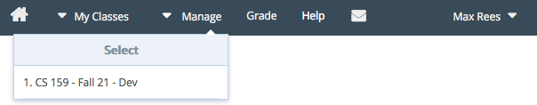
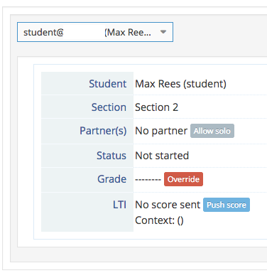
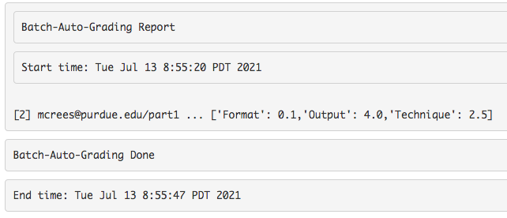
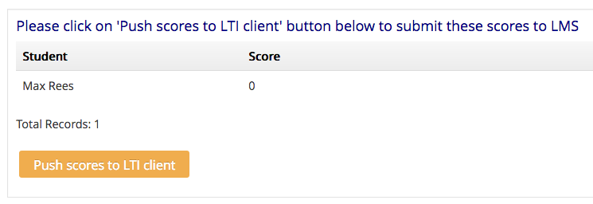
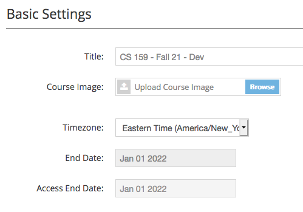
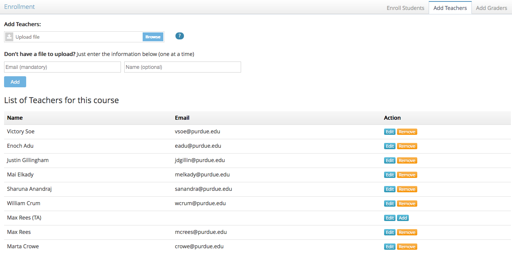

.. vi: ts=2 sts=2 sw=2 et spell tw=72

=======================================
 CS 15900 & Vocareum: lecturer's guide
=======================================
.. contents::
   :backlinks: top
.. section-numbering::
   :suffix: .

--------------------------------
 Getting started: the main menu
--------------------------------
Navigate to `labs.vocareum.com <https://labs.vocareum.com>`_. This
website is where you will manage your Vocareum course, where teaching
assistants will leave feedback for their students, and where the
students will do all of their work.

At the top of the screen you will see a dark blue menu bar which we will
call the "main menu".



In Vocareum, the highest level of access for a course is called a
"Teacher", and this will be the role you have as a lecturer. For
Teachers, the main menu entry that you will use is "Manage", from which
you can select the course with which you want to work.

You will notice that there are also a few other tabs. "My Classes" is
the primary tab for the Student's view. It will only be useful to you if
you enroll yourself as a Student in the course, which will be covered
later. Likewise, the "Grade" tab is the primary destination for teaching
assistants, which are classified in Vocareum as "Graders".

The "Help" link leads to Vocareum's documentation and help website. The
house-shaped icon goes to your home page, which has a listing of all
courses you have access to, including a link for each different role
(Student, Grader, or Teacher).

The mail-shaped icon goes to your Vocareum messages page, where you
receive notifications from Vocareum when certain processes are
completed, such auto-grading, pushing grades to Brightspace, and so on.
It will bounce up and down if you have new messages, and will continue
to do so until you read them.

The menu entry with your name on it has links to some personal settings
and a "Logout" entry.

Click one of the courses in the "Manage" menu to begin working on the
course.

--------------------------
 The assignment dashboard
--------------------------
When opening a class from the "Manage" menu, your first stop is
typically the "assignment dashboard", which gives you the ability to
supervise each assignment in detail.

The left side of the screen will show the course title, and the
currently selected assignment. You can click the assignment's title to
select a different assignment.

.. image:: lecturer_dashboard_select_assignment.png
   :target: lecturer_dashboard_select_assignment.png

The right side of the screen shows the other menus available for a
Teacher on a white background, with "Dashboard" currently selected.
Below that is the "assignment dashboard menu" on a silver background,
with "Summary" currently selected. We will talk about all of these
different menus in detail.

.. image:: lecturer_dashboard_menus.png
   :target: lecturer_dashboard_menus.png

~~~~~~~~~~~~~~~~~
 Student summary
~~~~~~~~~~~~~~~~~
Clicking on the "Summary" tab in the assignment dashboard menu leads to
the "Student summary" page. This page allows you to view information
about any Student in the course in regards to the currently selected
assignment.

Initially, there will not be much information available here if the
assignment is not yet public, or the Student hasn't yet opened the
assignment. Here we can see their name, email address, and section.
Three buttons are available.



.. _work alone:

Partner(s): **Allow solo**
  If the assignment has teams enabled, then there will be a "Partner(s)"
  table entry and an "Allow solo" button. This "Allow solo" button gives
  Teachers the ability to override the team membership minimum imposed
  on the Students, if Students are the ones forming the teams.

  .. admonition:: For CS 15900...

   Typically only "lab" assignments will have teams enabled, whereas
   homeworks and exams will be individual-only.  The lab assignments
   will have a minimum team membership of two so that Students cannot
   start on their own without at least one partner.

Grade: **Override**
  The "Override" button in the "Grade" table entry allows the Teacher to
  set a sticky score for the Student.

  .. caution:: Once set, this sticky score cannot be changed by either the
     auto-grader, nor by the teaching assistants.

.. _LTI push score:

LTI: **Push score**
  "LTI" stands for "Learning Tools Interoperability", and is the
  standardized specification of how external learning tools like
  Vocareum communicate with learning management systems like
  Brightspace. The "Push score" button allows the Teacher to manually
  send a score from Vocareum to Brightspace. You can also `push scores
  for an entire assignment through the export menu
  <#push-grades-through-lti>`_.

----

Once Students have opened their workarea but not yet made a submission,
the summary will look something like this. There are several new buttons
here.


.. _add partners:

Partner(s): **Add a partner**
  You can add any Student who has not yet become part of a team to this
  team. This overrides the `team size`_ that you specify in the `basic
  assignment options`_.

.. _dissolve a team:

Partner(s): **Dissolve team**
  After asking for confirmation, this unlinks the team and destroys
  their shared workspace.

  .. note:: This button is only available if the team has not yet made a
     submission. Once a submission has been made, the team cannot be
     dissolved, and thus its members cannot be moved to a different
     team, except by contacting Vocareum support.

Status: **Extend submission window**
  You can override the deadlines and/or allowed number of submissions
  for each individual, or for each team on team assignments.

Status: **Force submit: [workarea]**
  This acts as if the Student clicks the "Submit" button from their view
  of the assignment.

  .. admonition:: For CS 15900...

     This feature may cause problems if the Student's current code fails
     to compile or is missing their email address, and so on. Avoid
     using this feature if possible.

Status: **[upload]**
  You can upload files that will act as a Student's submission.

View: **Activity**
  An audit log of every user's interaction with the Student or team's
  assignment. *This will be a drop-down menu if there are multiple parts
  to the assignment.*

View: **Workarea**
  Show the view the Student would see of the workarea for the
  assignment, essentially allowing you to "impersonate" them. *This will
  be a drop-down menu if there are multiple parts to the assignment.*

View: **Submissions**
  Show what a teaching assistant would see for the given assignment.

.. _add a Grader to a specific Student:

Grader: **Add**
  Give an additional teaching assistant the ability to grade the
  assignment. Once a Grader has been added, there will also be an "Add
  more" button and a "Remove" button for each Grader. The "Remove"
  button may be missing if the Grader's access to the course has been
  disabled in the `class enrollment manager`_.

Grade: **Team override**
  Set a sticky score for the entire team.

Grade: **Individual override**
  Set a sticky score for an individual team member.

  .. caution:: As before, these sticky scores cannot be changed by
     either the auto-grader, nor by the teaching assistants once they
     are set.

Once a submission has been made and the auto-grader has been run, there
will be an additional button:

.. _auto-grade flag:

Status: **Reset auto-grade flag**
  Every time the auto-grader runs in Vocareum, it marks the assignment
  as having been auto-graded already. This button allows an individual
  assignment to be auto-graded *again* during the next batch.

  .. note:: If the flag has already been reset, or if the auto-grader
     has not been run yet, this button will not be visible.

  You can also `reset auto-grade flags`_ for all submissions of a given
  assignment at once.

~~~~~~~~~~~~~~~~~~~~
 Submissions tables
~~~~~~~~~~~~~~~~~~~~
Clicking on the "Submissions" tab in the dashboard sub-menu (with the
silver background) lists the status of all submissions made for the
assignment.


This tells us information such as:

* whether the Student or team has opened the workarea yet ("Started")
* if the last submission (if any) was considered late or not
* the section of the Student or team, if applicable
* the assigned Grader (teaching assistant) for the Student or team, if
  one has been assigned yet
* the final grade for the assignment, if one has been given
* and whether any feedback has been left by a Grader or Teacher

* how many parts of the assignment they have submitted, if there is more
  than one part
* the number of parts that have been graded, if there is more than one
  part

The last column ("View") is a link to open the grading view for the
submission.

The view looks slightly different if the assignment has multiple parts.

.. image:: lecturer_dashboard_submissions_multipart.png
   :target: lecturer_dashboard_submissions_multipart.png

Namely, the submission lateness column is replaced with a column
indicating how many of the assignment's parts have been *submitted*, and
the feedback column has been replaced with a column (moved to the left
after the Grader column) indicating how many of the parts have been
*graded*.

There is also another tab named "Submissions Jobs". This lists when each
execution of the *submission script* started, ended, and how much time
elapsed.


The "Auto-Grade" tab gives similar information for each execution of the
*grades script*.


~~~~~~~~~~~~~~~
 Graders table
~~~~~~~~~~~~~~~
The "Graders" tab in the assignment dashboard gives a similar listing of
each Grader's progress in assessing their Students' submissions. The
"Weight" column can be used to calculate a weighted average grade if
multiple Graders are assigned for a single Student or team.

.. admonition:: For CS 15900...

   Since only one Grader will be assigned to each section, these weights
   should always be "1".


~~~~~~~~~~~~~~~~~~~~~
 Assignment controls
~~~~~~~~~~~~~~~~~~~~~
The "Controls" tab (with the gear icon) in the assignment dashboard
gives access to several possible actions for managing the currently
selected assignment.


````````````````
 Assign Graders
````````````````
This option lets the Teacher assign a Grader for every submission that
has been made to the assignment so far. You can randomly assign Graders
based on sections, from a CSV file, reuse the same pairings as the last
time this action was taken, or randomly assign them irrespective of
sections.


The format of the CSV file is each Student's email in column one,
followed by each Grader's email in column two.

.. admonition:: For CS 15900...

   Since only one Grader will be assigned to each section, you should
   always choose "Random - section based".

``````````````````````````
 Publish/unpublish grades
``````````````````````````
This allows Students to view their scores in Vocareum, including the
grade report generated by the auto-grader. This has no effect on the
visibility of grades on Brightspace.

If grades are unpublished, you have the option to publish them; if they
are already published, you have the option to unpublish them again.

.. caution:: You will not be asked to confirm this change! It will take
   effect immediately.

You can also toggle grade visibility by changing the `basic assignment
options`_ in the assignment editor.

``````````````````
 Upload teams CSV
``````````````````
You can force Students to be on specific teams by uploading a CSV file
through this option. Each team is a row in the file, with each column
containing a Student's email address.

You will then receive a message on Vocareum (the "mail" icon will bounce
up and down) when the teams have been processed. This message will tell
you how many errors occurred (such as a Student already being a member
of a team, etc.).

.. note:: At times, you need to delete the message if you want the mail
   icon to stop bouncing.

This feature prevents Students from selecting their partners, but you
can `dissolve a team`_ in Vocareum up until one of its members opens the
workarea for the first time. You can also `add partners`_ to the team at
any time.

Make sure the minimum and maximum `team size`_ is configured correctly
in the `basic assignment options`_ if you want to allow Students to
select their own team members. The size specified there does not
constrain your CSV in any way, however.

````````````
 Auto-grade
````````````
This starts a new execution of the grades script. Submissions are
included in the batch if:

* they have not yet been auto-graded, or
* if they have had the `auto-grade flag`_ reset by a Teacher.

You will be prompted to confirm this is what you want to do. If there
are multiple parts to the assignment, you can also select which parts to
auto-grade (each part can have a different grading script).

Once you have confirmed, the window will continue to update as the batch
is processed, or you can wait for the results to go to your Vocareum
messages, which looks like the following:



```````````````````````
 Reset auto-grade flags
```````````````````````
You can reset the `auto-grade flag`_ for every submission using this
option, so that all submissions will be auto-graded the next time the
grades script is executed. Click the link to learn how to reset the
auto-grade flag for an individual Student or team.

````````````````
 Compute grades
````````````````
.. admonition:: This feature has not yet been investigated.

   It is probably related to either the part aggregation rule
   (determining the total score for an assignment based on scores for
   each part), or the assignment option that chooses the highest
   submission score instead of the latest submission score.

````````````````````
 Upload submissions
````````````````````
.. admonition:: This feature has not yet been investigated.

   I believe you can upload a ZIP file that will place files into each
   workarea, but the exact semantics of this (file conflicts, the
   structure of the ZIP file, etc.) are unknown at this time.

~~~~~~~~~~~~~~~~~~~~
 Assignment exports
~~~~~~~~~~~~~~~~~~~~
There are a variety of different reports you can generate to get
detailed information about the currently selected assignment.


```````````````
 Export grades
```````````````
You can export reports on Students' grades for the currently selected
assignment as a CSV file. Values with spaces are quoted. Values with
multiple lines have embedded carriage return and newlines embedded as
literals.


With all options turned off, the format is the following:

== =========== =========================================================
#  Name        Description
== =========== =========================================================
01 User        The Student's full name in Vocareum.
02 Section     The section name of the Student, if any.
03 Score       The total score on the assignment for the Student.
               If no score has been given yet, it will be a series of
               dashes (``--------``).
== =========== =========================================================

Students dropped from the course on Vocareum are not included; neither
are Students who have not yet made a submission.

**Show email**
  Inserts the Students' email addresses as a new column after "User"
  named "Email".

**Name**
  Seems to be a duplicate of the "User" column and should be turned off.

**Parts**
  Adds a column for each assignment part, giving the total score for
  that part.

**Details**
  Adds the following columns:

  ==================================== =================================
  Name                                 Description
  ==================================== =================================
  ``[part name.]criterion name``       The current score for this
                                       criterion.
  ``Max ([part name.]criterion name)`` The maximum score for this
                                       criterion, based on all previous
                                       submissions for this Student.
  ``[part name: ]Review Comments``     Feedback left by Graders or
                                       Teachers.
  ==================================== =================================

**All assignments**
  Include the relevant columns for every assignment in the course in
  each Student's row. The column names are prepended with the
  assignment's name followed by a period, but the total score column for
  each assignment is named ``Score: assignment name`` instead. The
  overall score for the class is given in the ``Score`` column.

``````````````````````````
 Export submission report
``````````````````````````
You can export a CSV file that includes information on each Student that
has made a submission to the assignment.


===================== ================ =================================
Enabling option       Name             Description
===================== ================ =================================
Show ID               ID               Vocareum configurable ID for the
                                       Student.
Show e-mail           email            Student's email address.
Show name             name             Student's name.
Late flag(Y/N)        late             ``Y`` if considered late,
                                       otherwise ``N``.
Start date-time       start date-time  Whenever the Student first
                                       attempted to open the assignment,
                                       e.g. ``Jul-15-2021 7:59:25 pm
                                       EDT``.
Submission date-time  last submission
                      date-time
                                       e.g. ``Jul-15-2021 8:15:30 pm
                                       EDT``.
**Always enabled**    submission count Number of submissions the Student
                                       has made.
===================== ================ =================================

If all options are disabled, then only the submission counts are
returned with no identifying Student information.

The drop-down lets you include "all Students", or filter by "late" or
"on time" Students only.

``````````````````````````````
 Export submitted assignments
``````````````````````````````
The latest submission made by each Student for this assignment is
collected into a ZIP file. The directory structure is
``email/partname/submission_N`` where ``N`` represents it being the Nth
submission by the Student. All files not starting with a period (``.``)
in the Student's workspace at the time of submission are included in the
submission folder, as well as files saved by the submission or grades
scripts, or by Vocareum. This includes:

==================================== ===================================
Name or extension                    Description
==================================== ===================================
``*.compile``                        Output captured from the compiler
                                     at submission time.
``*.elf``                            Executable created by the compiler
                                     at submission time (instead of
                                     ``a.out``).
``submit.rst``                       Submission report in a plain-text
                                     format. This is essentially the
                                     same contents as the submission
                                     receipt email that gets sent to
                                     Students.
``.vocStudentSubmissionReport.txt``  Identical to the above, but
                                     contains the starting execution
                                     time (in Pacific Time) of the
                                     submission script.
``.vocStudentSubmissionReport.html`` Submission report in an HTML
                                     format.
``grade.rst``                        Grade report in a plain-text
                                     format, as generated by the
                                     auto-grader.
``.vocStudentGradingReport.txt``     Identical to the above, but
                                     contains the starting execution
                                     time (in Pacific Time) of the
                                     grading script.
``.vocStudentGradingReport.html``    Grade report in an HTML format.
==================================== ===================================

Two (mutually exclusive) options are supported:


**All Students**
  Also create empty folders for the Students who have not submitted.

**De-identified folders**
  Instead of using the Students' email addresses as folder names, use
  random strings like ``f73ce498bb2195d094f142a03f7d9697``.

Once submitted, the ZIP file will appear in your Vocareum Messages (mail
icon).

.. note:: There appears to be some bugs with this feature. Namely, some
   Students are mistakenly included when they should not be (e.g. they
   may be included if they have not even started, let alone submitted,
   if "all Students" is enabled); or, they may be excluded when they
   should be included (it seems if the Teacher is also a Student,
   submissions from that Student account are not included).

``````````````````````
 Export code comments
``````````````````````
This exports a CSV file with the following format:

== ============ ========================================================
#  Name         Description
== ============ ========================================================
01 Student      Student's Vocareum identification number.
02 Email        Student's email address.
03 Name         Student's name.
04 Part         Name of the assignment part.
05 File         Pathname of the file, rooted in the Student's workarea.
06 Line number  Line number for which the comment is attached.
07 Cell         **Unknown** (has only been observed to be blank).
08 Code comment The text of the comment.
09 Reviewer     The name of the Grader that left the comment.
== ============ ========================================================

These are the in-line comments left in the Grader interface.

.. admonition:: For CS 15900...

   Since Students will not be able to view in-line comments left by
   Graders at this time, this report should always be blank as Graders
   will be discouraged from using this feature.

`````````````````````````
 Export assigned Graders
`````````````````````````
This exports a CSV file with the following format:

== =====================================================================
#  Description
== =====================================================================
01 Student's email address.
02 Email address for the Grader assigned to this Student for this
   assignment.
== =====================================================================

.. note:: If multiple Graders are assigned to a single Student, then
   a row will appear for each Student/Grader pair.

`````````````````````````
 Push grades through LTI
`````````````````````````

You will be prompted with a screen like the following which shows the
score that will be sent to Brightspace for each Student. Click the
orange "Push scores to LTI client" button to send the scores to
Brightspace. If any errors occur (such as sending a score for a dropped
Student), you will be sent a Vocareum Message.



You can also `push a score for an individual Student
<#lti-push-score>`_.

----------------
 Class settings
----------------
Now we will look at settings pertaining to the class as a whole. Click
"Settings" in the white navigation bar at the top of the screen.

You must click the blue "Save class" button at the bottom of the screen
to save any changes you make.

~~~~~~~~~~~~~~~~~~~~~~
 Basic class settings
~~~~~~~~~~~~~~~~~~~~~~


From `Vocareum's documentation on basic course settings
<https://help.vocareum.com/en/articles/3658991-basic-course-settings>`_:

**Title**
  The name of the course that all the users will use to select a course.

**Course image**
  An optional image displayed on the "Card View" home page for this course.

**Timezone**
  This will be used for all the settings when time is needed like due date for
  submissions.

  .. note:: This should always be set to Eastern Time to ensure due dates are
     in alignment with Purdue's local time. Regardless, some areas of Vocareum
     may still report times in Pacific Time since that is where Vocareum is
     based. This is mostly contained to things like batch script
     execution reports and other things not visible to Students.

**End date**
  This is the date when the course ends. As a Teacher you can not change this
  date. After this date Students will no longer be able to work on their
  assignments. As a Teacher you will continue to have access to the course.

**Access end date**
  While the Students can no longer work on their projects after the "End Date",
  they can continue to access their data until this date. You can change this
  date.

~~~~~~~~~~~~~~~~~~
 LTI/LMS settings
~~~~~~~~~~~~~~~~~~


LTI (Learning Tools Interoperability) should always be enabled so that
Brightspace (the LMS) can communicate with Vocareum and vice versa. For
now, the **LTI version** should always be ``v1.1``, **Auto create
sections** should be *disabled* (pending a future update that will allow
this functionality to work), and **Send total score (Canvas)** should be
*disabled* since we do not use Canvas.

This leaves **Show all assignments** which is left to your choice. When
it is *enabled*, Students can see every assignment that is published on
Vocareum at any time. If it is *disabled*, Students can only view one
assignment at a time, and only via direct links or through links from
Brightspace. In the latter configuration one would only need worry about
the visibility of assignments on Brightspace, but the former
configuration makes it easier for Students to view their past work and
feedback without needing to return to Brightspace.

~~~~~~~~~~~~~~~~~~~
 Skilljar settings
~~~~~~~~~~~~~~~~~~~


.. admonition:: This feature has not yet been investigated.

   This is an external integration into Vocareum that has not yet been
   used. Leave it *disabled*.

~~~~~~~~~~~~~~~~~~~
 Course parameters
~~~~~~~~~~~~~~~~~~~


Sections should be *enabled*. You can add more sections here or rename
existing ones. Note that once sections are enabled, they cannot be
disabled. The enrollment manager allows you to `add Students to specific
sections <#adding-students>`_ as well as `assign Graders to each section
<#adding-graders>`_.

.. admonition:: Some of these features have not yet been investigated.

   **No submission**
     Presumably disables any Student from making any submission in the
     entire course.

   **Mastery levels**
     This feature grants the ability to restrict a Student's progression
     on current assignments if they have not yet completed previous
     assignments. Enabling it reveals a "Mastery level" option on each
     assignment which is an integer, as well as a
     ``VOC_LEVEL_COMPLETED`` rubric checkbox in the Grader interface
     (which can also be set by the submission or grading scripts).
     Checking this box indicates that the Student has completed the
     level.

     Students must complete all assignments with lower mastery level
     numbers before they can begin assignments with higher levels.

     There is also an option to restrict the mastery level checking to
     only parts within a single assignment.

     More information can be found in `Vocareum's documentation on
     mastery levels
     <https://help.vocareum.com/en/articles/3659011-mastery-learning>`_.

   **Slip days**
     It seems like you can allocate a number of "slip days" to each
     Student for the given semester. Each day that a Student's
     submission is late consumes a slip day and bypasses the typical
     penalty. When this option is set to a value greater than zero, a
     "Students allowed to use slip days" toggle appears. This lets
     Students choose when to use slip days rather than Vocareum
     automatically using them.

     This also reveals a "Max slip days" configuration option for each
     assignment which restricts how many slip days can be used on that
     particular assignment.

     More information can be found in `Vocareum's documentation on slip
     days <https://help.vocareum.com/en/articles/3659016-slip-days>`_.

~~~~~~~~~~~~~~~~~~~~~~
 Other class settings
~~~~~~~~~~~~~~~~~~~~~~
.. admonition:: For CS 15900...

   The other sections, such as "Container resources" and "Code editor
   settings" are not applicable to our course since we do not use these
   features of Vocareum.

   The settings in "Resource limits" should be left at their default
   values.

--------------------------
 Class enrollment manager
--------------------------
By clicking "Enroll" in the white menu next to "Dashboard", we can add
more Students, Graders, or Teachers to the course, or view the existing
enrollments.

~~~~~~~~~~~~~~~~~
 Adding Students
~~~~~~~~~~~~~~~~~
Typically you will not need to add more Students manually since their
account is automatically created when they click the assignment links in
Brightspace. However, this page allows you to add more Students, and
view or edit the existing ones.


At the top of the screen you can add new Students manually. You are
required to enter at least an email address and a section. The name,
while optional, should be entered as it is the only visible identifier
for the Student in some areas. The ID column may be auto-populated if
the Student was enrolled through Brightspace, but it is not used by any
of the CS 15900-specific configuration.

You can also upload a CSV file to enroll multiple Students at once.
Include a header in row 1 that has at least the following values as
columns:

* Email
* Section

You can optionally add one or both of these columns as well:

* Name
* ID

The columns can be in any order that you specify.

If you are using the CSV upload feature, click the big blue "Enroll"
button above the table to upload and process the CSV file.

The table of Students shows information for every Student in the class.
You can click the checkbox "Hide dropped Students" to exclude Students
you've dropped from the Vocareum class from this table. The totals are
included in the table heading. Clicking "Section details" will reveal
the number of enrolled Students for each section of the class.

For each Student, you can choose to either "Edit" their information,
"Drop" them from the Vocareum class, or "Enroll" them back into it.

.. note:: Dropping a Student from the Vocareum class takes effect
   immediately and locks the Student from accessing any of the class
   content on Vocareum. However, all of their data is preserved and you
   can re-enroll them at any time using this same page.

Clicking the "Edit" button shows the following menu, where you can edit
any of the Student's information, including their section membership.


Clicking the "Click here to load" yellow box will load a log of all
emails ever sent by Vocareum to the Student. At the moment, these are
just enrollment emails. By clicking the orange "Resend Email" button,
you can re-send an enrollment email to the Student. This email contains
the name of the course, a link to the login page, and a password that
can be used to login to Vocareum directly instead of clicking links in
Brightspace.

~~~~~~~~~~~~~~~~
 Adding Graders
~~~~~~~~~~~~~~~~
Teaching assistants are enrolled into your Vocareum class as "Graders",
which allows them to only view submissions to which they've been
assigned to grade, the ability to override grades from the auto-grader
for those submissions, and leave feedback for the Students.

At the moment, there is no Brightspace link to enroll Graders
automatically, so you will have to use this page - unlike the Student
enrollment manager.


Again, you can either enter the Grader information manually one at a
time, or upload a CSV file. The only mandatory information is the
Grader's email address ("Email" column), but you can also include a
"Name" column and a "Section" column. Note that unlike Students, Graders
don't have to belong to *any* section - in which case they default to
having access to **all** sections.

If you are using the CSV upload feature, click the big blue "Add" button
above the table in order to upload and process the CSV file.

.. admonition:: For CS 15900...

   In general, each section of the class should only have **one** Grader
   assigned to it, but each Grader may have multiple sections assigned
   to them. This makes it easy to `assign Graders`_ in the assignment
   dashboard using the "random - section based" option.

You can click "Disable" to disable a Grader's ability to access the
course, which will take effect immediately. An "Enable" button will take
its place and allow you to undo this change.

You can also change the Grader's details, including their section
assignment, using the "Edit" button.


This only allows you to **add** another section to the Grader's load. In
order to remove a section, click the blue "X" next to the section name
in the Grader's table entry.

.. warning:: After removing the last section from a Grader, this will
   return to giving them access to **all** sections. Click "Disable" in
   their table entry to lock them out of the course entirely at any time
   (you do not need to remove their sections first).

You can also click the orange "Resend Email" button to send a welcome
email in a similar fashion to Students as mentioned earlier.

.. important:: If this is the first time the Grader has used Vocareum,
   you may need to click this button manually so that they can login to
   Vocareum at all! You can double check using the email log feature.
   Remind Graders to change their password after logging in.

~~~~~~~~~~~~~~~~~
 Adding Teachers
~~~~~~~~~~~~~~~~~
Likewise, you can add other Teachers to the course. They will have the
same access to the entire course as you do. You cannot limit Teachers to
specific sections.



As before, you can either enter the new Teacher information manually one
at a time, or upload a CSV with emails (and optionally names). Click the
big blue "Add" button above the table to upload and process the CSV file
if you select one.

Clicking "Remove" on any Teacher will disable their access to the
course - but only as a Teacher (they may still have access as a Grader
or Student, and vice versa for dropping Students or disabling Graders).
This will take effect immediately, but you can click the blue "Add"
button in their table entry to reinstate their access at any time.

Editing a Teacher allows you to change their name or email address.


You can also click the orange "Resend Email" button to send a welcome
email in a similar fashion to Students as mentioned earlier.

.. note:: Using this feature, you can send yourself a password that
   allows you to login without going through Brightspace. **Make sure
   that you change your password after using the password from the email
   you receive!** You can do so by clicking your name in the top right
   corner, clicking "Settings", and then the "Change Password" tab.

---------------------
 Editing assignments
---------------------
Assignments on Vocareum have many different configuration options. When
you first open an assignment for editing, you will be presented with a
screen that looks like the following. On the left hand side of the
screen is the list of assignments (organized into different user-defined
groups), and on the right hand side of the screen is the settings for
the currently selected assignment (the assignment with a blue bar in the
assignment selector).


Along the top of the screen are the following actions you can take.

**New assignment**
  Create a new assignment from scratch. This is not recommended as you
  will have to change a lot of settings.

**New group**
  Create a new group in which to categorize assignments (like "Sandbox"
  in the screenshot).

**Copy assignment**
  Copy an assignment to any class on Vocareum (including the same one).

**Copy group**
  Likewise, but with an entire assignment group.

Below these actions are three blue buttons which are specific to the
currently selected assignment.

~~~~~~~~~~~~~~~~~~~~~
 Assignment settings
~~~~~~~~~~~~~~~~~~~~~
Across the top of the screen are three blue buttons.


**Save**
  You must click "Save" after making any changes to the assignment.

  .. warning:: You will lose any unsaved changes if you navigate away
     from the page without saving, which includes opening `part
     settings`_!

  Your changes will take effect immediately. If the assignment is
  currently published, you will be asked to confirm that you want to
  save your changes first.

**Publish** or **unpublish**
  This changes the visibility of the assignment **for Students only**.
  Graders always have access to submissions to which they've been
  assigned for an assignment, regardless of the assignment's visibility.
  Also note that this **does not affect visibility of anything on
  Brightspace**.

  Your change will take effect immediately.

**Configure workspace**
  This opens the `assignment workbench`_ which is where you can upload
  your solution program, define test cases, and change other auto-grader
  settings.

````````````````````````
 Assignment information
````````````````````````
The section below that lets you change the assignment name, its position
on the assignment list, and add an optional description that is shown to
Students before they enter their workarea.


``````````````````
 Assignment parts
``````````````````
The table below the assignment information settings lists all of the
"parts" of an assignment. Each part can be submitted and graded
independently from one another, and the overall grade for the assignment
can either be the sum of the parts' grades, or the maximum grade
obtained on any of the parts.


The blue link for the part's name takes you to the `part settings`_ for
that part. The actions you can take on each part in this table include:

* The "info" icon (circled lowercase "i") opens a pop-up that shows the
  Vocareum-internal identification numbers for the course, assignment,
  and part.
* The "chain link" icon opens a pop-up that shows the direct link for
  the assignment. **You typically won't need this since you will be
  linking the assignments through LTI on Brightspace.**
* The "trash can" icon allows you to delete a part from the assignment.
  You will be asked to confirm this. This action will take effect
  immediately afterwards, even without clicking the "Save" button.

  .. note:: There appears to be a bug in Vocareum where the names of
     deleted assignment parts cannot be used again as a name for a part
     in that particular assignment.

* The "up/down" icon lets you rearrange parts visually if there is more
  than one.

You can add a new part using the gray button with a plus sign ("+") in
it, if the assignment is unpublished. If it is currently published, you
must first click the blue "Unpublish" button at the top of the screen
before this "new part" button becomes visible.

``````````````````````````
 Basic assignment options
``````````````````````````


**Publish grades**
  This makes the grades for the entire assignment visible to Students
  **on Vocareum** (it does not effect visibility of grades on
  Brightspace). You can also toggle grade visibility using the
  `publish/unpublish grades`_ option in the "controls" menu of the
  assignment dashboard.

.. _team size:

.. _team project:

**Team project**
  Enables multiple Students to work on the assignment at the same time
  and receive the same grade for it.

  .. admonition:: For CS 15900...

     All homework assignments in our class are individual, while all lab
     assignments are "team projects".

  Selecting this checkbox reveals a blue button that reads "Team
  assignment setup", which opens the following pop-up.

  .. image:: lecturer_assignment_teams.png
     :target: lecturer_assignment_teams.png

  This minimum and maximum are the limits for Student-created teams.
  Students cannot form a team on their own with less than the minimum
  amount of Students specified here (including themselves), or more than
  the maximum.

  The Teacher has the ability to override these limits in several ways:

  * Allowing particular Students to `work alone`_.
  * `Add partners`_ yourself, optionally in excess of the limit imposed
    here.
  * `Dissolve a team`_ if nobody on the team has opened the workarea
    yet.
  * `Upload teams CSV`_ before the assignment is published to force
    Students to be in particular teams.

.. _section based timelines:

**Section based timelines**
  Set different deadlines for each section. You can manually set these
  using the interface, or upload a CSV file. Each of the deadlines is
  optional.

  .. image:: lecturer_assignment_deadlines.png
     :target: lecturer_assignment_deadlines.png

  The format of the CSV file is the following. You can leave columns
  empty if they are not applicable.

  == ========================= =========================================
  #  Name                      Description
  == ========================= =========================================
  01 Section name              Name of the section for which these
                               deadlines should apply.
  02 Submission deadline       Students must submit the assignment
                               before this date and time in order to be
                               considered an "on time" submission,
                               subject to the grace period setting.
  03 Early submission deadline If Students submit before this date and
                               time, they get some bonus points added to
                               their final score.
  04 Early submission points   The number of points to add if the
                               submission is made before the early
                               submission deadline.
  05 Late submission           If enabled, Students can continue to
                               submit the assignment after the
                               submission deadline up until the late
                               submission deadline, subject to the grace
                               period setting. There will be a deduction
                               from their final score according to the
                               late penalty settings.
  06 Access date               Restrict the ability to open the
                               assignment until after this date and time
                               passes.
  == ========================= =========================================

.. admonition:: These features have not yet been investigated.

   The rest of the options should be **disabled**:

   * Peer review
   * Leaderboard
   * Auto-submit: in particular, this could be problematic for CS 15900
     as a program that fails to compile might be submitted and taken as
     the last submission which would jeopardize Student scores.

````````````````
 Assignment LTI
````````````````
This checkbox controls whether the currently selected assignment can be
added as an external learning activity in Brightspace or not. When LTI
is active, Students **must** access the assignment through Brightspace
at least once - the direct link from the `assignment parts`_ table will
not work, even if they have already been enrolled as Students in the
class.


Once LTI is enabled, you need to go to Brightspace in order to link the
assignment. On a content module, click "Existing activities", then
"Vocareum".


You will be presented with a list of Vocareum assignments. **Only
assignments with LTI enabled will be show in this list**. For each
assignment, you can either choose to embed the Vocareum page inside of
Brightspace (``iframe``), or open the page in a new tab.


.. caution:: Even if an assignment has already been linked into
   Brightspace, it will still appear in this menu, allowing you to
   possibly link the same assignment multiple times. It is unknown as to
   what happens if this occurs.

.. note:: Linking a Vocareum assignment into Brightspace will not change
   the assignment's visibility on Vocareum. You must publish the
   assignment in the `assignment settings`_ (click the blue "publish"
   button at the top of the page) in order for it to actually be
   accessible by Students.

.. note:: There appears to be a bug with either Vocareum or Brightspace
   at the moment where the "new tab" button does not work, instead
   behaving exactly the same as the ``iframe`` button which forces new
   assignments to always be embedded inside of a Brightspace page.

   To work around this, first click the arrow next to the assignment's
   name in the Brightspace content module, then select "edit properties
   in-place."

   .. image:: lecturer_assignment_lti_brightspace_newtab1.png
      :target: lecturer_assignment_lti_brightspace_newtab1.png

   Then, click the checkbox that says "open as external resource". Your
   changes should be saved immediately.

   .. image:: lecturer_assignment_lti_brightspace_newtab2.png
      :target: lecturer_assignment_lti_brightspace_newtab2.png

```````````
 Exam mode
```````````
.. admonition:: This feature has not yet been investigated.

   This will be useful if we want to continue delivering lab practical
   exams, but its exact semantics have not yet been determined.

   Note that you cannot toggle exam mode on or off while the assignment
   is currently published on Vocareum. Unpublish the assignment using
   the blue "unpublish" button at the top of the page first to make any
   changes.

`````````````````````````````
 Advanced assignment options
`````````````````````````````
There are some more settings hidden under the "advanced" headline. Click
it to reveal them.


**Passcode protect**
  Students can not view the assignment at all until they enter the
  password you specify here. Once Students have entered the password,
  however, they cannot be locked out again.

  .. caution:: In particular, this means it is useless to add a password
     after Students have already opened their workarea for the first
     time, as it will not apply to them.

**Grading visibility**
  You can choose between "assigned submissions" (recommended) or "all
  submissions", which shows a new tab in the Grader interface with every
  Student's submission for a given assignment.

  You can `assign Graders`_ in the `assignment controls`_, or `add a
  Grader to a specific Student`_ in the `Student summary`_, both located
  in `the assignment dashboard`_.

**Grading visibility: anonymous**
  Hide the Student's names from the Graders. Instead, only their
  Vocareum-internal user identification number will be shown.

  .. warning:: This has no effect on the contents of the submission, so
     if any of the files in the submission (whether created by the
     Student, the submission script, or the grading script) contains the
     Student's name or email address, the Grader will be able to see
     that!

.. _copy startercode:

**Copy startercode**
  All of the files in the ``resource/startercode/`` folder will be
  copied into the Student's workspace when it is first created.

**Auto-grade on submit**
  Run the grading script immediately after each submission is made.
  Grades will still not be visible until you use the `publish/unpublish
  grades`_ control in assignment dashboard or toggle the "publish
  grades" option in the `basic assignment options`_.

**Grace period**
  If enabled, Students can still submit and be considered "on time" with
  respect to the submission deadline or late submission deadline, as
  long as the grace period has not yet elapsed. You can configure it to
  be between one minute and 60 days, and have it only apply to the
  submission deadline or both the submission deadline and the late
  submission deadline.

**Aggregation rule**
  Determines how the assignment's total score is calculated based on the
  scores from the `assignment parts`_. You can either add them all up
  ("sum of all parts"), or select the best score on any of the parts
  ("maximum score").

.. admonition:: Some of these features have not yet been investigated.

   As such, they should be left **disabled** or with their default
   values.

   * IP address range
   * Generate startercode
   * No submission
   * No workarea

~~~~~~~~~~~~~~~
 Part settings
~~~~~~~~~~~~~~~
Click on one of the part names in the `assignment parts`_ table. This
opens the part settings page. Similarly to the `assignment settings`_,
there are three blue buttons across the top.


**Save part**
  Save any changes made to this part's settings.

  .. warning:: You will lose any unsaved changes if you navigate away
    from the page without saving, which includes returning to the
    `assignment settings`_!

**Publish**
  Same as in the assignment settings - change the visibility of the
  assignment on Vocareum.

**Configure workspace**
  Same as in the assignment settings - open the `assignment workbench`_.

Above the "save part" button is a left arrow (``<``) button that will
allow you to return to the assignment settings.

````````````````````
 Basic part options
````````````````````
Below the blue buttons are the most basic settings for a part, including
the part's name and type of Vocareum setup.


**Part name**
  The name of this assignment part. When there is more than one part,
  these names become visible to Students.

  .. note:: Part names should not contain spaces, as it seems there are
     bugs in Vocareum that will consider names containing spaces as
     equivalent. Each part must have a unique name.

.. _lab type:

**Lab type**
  The type of Vocareum interface to use for this part. The options
  available are:

  * Vocareum Standard
  * Vocareum Basic
  * Vocareum Elite
  * Jupyter Notebook
  * RStudio
  * MySQL Workbench
  * Thonny
  * Desktop
  * Container Lab
  * VM Lab
  * RStudio Elite
  * Jupyter Elite
  * Skulpt Basic

  .. admonition:: For CS 15900...

     Always select "Vocareum Elite".

**Terminal**
  There are two options here: "Terminal v1" and "Terminal v2". "Terminal
  v1" is the terminal used (regardless of the part settings) when inside
  the `assignment workbench`_. It consists of dark text on a light gray
  background, with a dark blue bar across the top.

  .. image:: lecturer_part_terminal.png
     :target: lecturer_part_terminal.png

  The "+" icon allows a new tab to be opened, with the currently
  selected tab denoted by a white dot (""), and other tabs denoted by
  gray dots. The terminal starts with only one tab by default.

  Output from the submission script will appear in this terminal when a
  Student clicks the "Submit" button.

  "Terminal v2" has white text on a black background, and no tab
  interface. Output from the submission script **does not** appear in
  this terminal.

```````````````
 Lab resources
```````````````
.. note:: The settings here depend on the choice of "lab type" in the
   previous section. We will only cover the settings applicable to the
   "Vocareum Elite" lab type.

This section configures the workarea in which Students will complete
their assignments, as well as the machine on which submission and
grading will occur.


**Database**
  Whether the workarea will have access to a database server of some
  kind or not. For more information, consult the `Vocareum documentation
  on databases
  <https://help.vocareum.com/en/articles/3658994-database>`_.

**Spark cluster**
  Give the workarea access to machines that have Apache Spark and Hadoop
  installed on them. For more information, consult the `Vocareum
  documentation on clusters
  <https://help.vocareum.com/en/articles/3659002-configuring-clusters>`_.

.. _server types:

**Interactive server type**
  The operating system to use for the interactive workareas; in
  particular, this is the operating system with which Students will be
  directly interacting.

**Batch server type**
  The operating system to use for batch processes like submission and
  grading. This should match the option chosen for the interactive
  server type for consistency.

```````````````
 Lab interface
```````````````
.. note:: The settings here depend on the choice of "lab type" in the
   previous section. We will only cover the settings applicable to the
   "Vocareum Elite" lab type.

These settings control the Vocareum GUI for the Student workarea.


Panels: **Source**
  A text editor panel similar to the one shown in the `assignment
  workbench`_. You can control the settings of this text editor for the
  class as a whole in the `other class settings`_.

Panels: **Console**
  The interactive terminal panel. The terminal type is configured in the
  `basic part options`_.

Panels: **File browser**
  A file tree pane similar to the one shown in the `assignment
  workbench`_, but with the ``resources/`` folder hidden and a
  ``Submissions/`` folder added that shows all of the Student's previous
  submissions.

Panels: **Nav bar**
  Show or hide the `Vocareum main menu <#getting-started-the-main-menu>`_.

Controls: **Reset**
  Include a button named "Reset" that will confirm if Students want to
  wipe their workarea clean and start again from scratch.

Information: **Details button**
  This option does not appear to change anything for the "Vocareum
  Elite" lab type.

Information: **README button**
  Include a button named "README" that will display the README file from
  ``$ASNLIB/public/docs/`` folder in a pane. You can choose from
  ``.txt``, ``.pdf``, ``.html``, and ``.md`` file formats, and even
  create READMEs in multiple languages by putting them in
  ``$ASNLIB/public/docs/lang/$language/``. For more information, consult
  the `Vocareum documentation on READMEs
  <https://help.vocareum.com/en/articles/4628823-delivering-multi-language-instructions-for-your-assignment-or-lab>`_.

Information: **Assignments**
  This option does not appear to change anything for the "Vocareum
  Elite" lab type.

`````````````````
 Part submission
`````````````````


**Due date**
  Similar to the assignment's submission deadline, but for this part
  only. See `section based timelines`_.

**Late submission**
  Allow submission after the due date for this part, subject to an
  optional penalty.

**Early submission bonus**
  Allow submissions made before this day and time for this part to earn
  a fixed amount of bonus points on their final score.

**Number of submissions**
  You can restrict the maximum amount of submissions a Student can make
  for this part to be anything between 1 and 600 submissions, or an
  unlimited amount.

  .. admonition:: For CS 15900...

     Failed submissions (e.g. program doesn't compile, missing email
     address, etc.) would count towards this limit.

**Submission interval**
  The minimum amount of time that must elapse before a Student can
  submit their assignment again. Setting it to zero hours and zero
  minutes means there is no limit to how often the Student can submit.

**Show solution**
  .. admonition:: This feature has not yet been investigated.

     You can choose to publish files from ``$ASNLIB/solution``
     immediately, after a fixed number of submissions (1 to 30), after
     the submission deadline, or after a custom "solution publish date".

     What is not known is whether these files would be viewable in our
     configuration of the Student workarea.

     For more information, consult `Vocareum's documentation on showing
     solutions <https://help.vocareum.com/en/articles/3659010-show-solution>`_.

``````````````
 Part grading
``````````````


**Late penalty rule**
  You can choose a percentage of either the Student's score or the
  maximum total score to deduct from their final score, or an
  exponential deduction.

**Late penalty type**
  Either fixed (one deduction only), or a compounding deduction that
  occurs every day, hour, or minute after the submission deadline.

**Grading rule**
  Either the latest submission from each Student, or the maximum score
  that each Student attains across any of their submissions.

**Max. grading CPU time**
  The maximum amount of time (in seconds, up to a limit of 1800 seconds
  which corresponds to 30 minutes) to spend running the entire grading
  script for this part for each Student's submission. The default of 300
  seconds corresponds to 5 minutes.

**Generate scripts**
  Have Vocareum generate a grading script based on the grading criteria
  you specify below.

**Grading criteria**
  These are the rubric items that are used to break down the Student's
  score. The score for each criterion can be freely manipulated by both
  the auto-grader and human Graders.

  You must specify a name and a point value. The sum of the point values
  for all criteria yields the maximum possible score for the assignment
  part (shown here, that would be 10 points).

  The "autograde" checkbox is only relevant if you have "generate
  scripts" (above) enabled, so leave it **disabled**.

  The "exclude" checkbox tells Vocareum to exclude this criterion from
  calculating the overall score and maximum possible score for the part.

  The red "X" icon lets you remove a criterion.

  The double-headed arrow icon allows you to rearrange the order the
  criteria will appear in when viewed by Graders and Students.

~~~~~~~~~~~~~~~~~~~~~~
 Assignment workbench
~~~~~~~~~~~~~~~~~~~~~~
Clicking the "configure workspace" button at the top of either the
`assignment settings`_ page or the `part settings`_ page will open the
"assignment workbench".


At the top left of the screen is the name of the assignment, which you
can click to return to the assignment settings. If there are multiple
parts, you will see the part name and select a different part on which
to work.


To the right hand side of the screen are various controls that you can
use.


**Generate quiz**
  .. admonition:: This feature has not yet been investigated.

     Vocareum allows you to create multiple-choice or multiple-answer
     quizzes using a special `Vocareum quiz Markdown flavor
     <https://help.vocareum.com/en/articles/4347087-building-graded-single-and-multiple-choice-questions-mcq>`_.
     You can read more about how to use this feature on `Vocareum's
     documentation on releasing quizzes
     <https://help.vocareum.com/en/articles/4349720-releasing-single-and-multiple-choice-questions-mcq>`_.

View: **Jupyter**
  This is only useful if the Vocareum `lab type`_ involves Jupyter. If
  you accidentally click this option, click "View: **Standard**" to
  return to the normal workbench view.

**Student view**
  Open a demonstration Student workarea for the current assignment.

**Update**
  When you make changes to most of the files using the workbench, those
  changes will not take effect immediately. Click this button in order
  to push your changes to all Students.

  There will be an asterisk if Vocareum thinks you've made changes that
  need to be pushed, but note that changes made through the terminal are
  not usually detected.

**Build image**
  Create a Docker container image based on the contents of the
  workbench. This is only useful if `lab type`_ involves containers.

Run scripts: **Grading**
  Simulate a run of the grading script based on the contents of the
  ``work/`` directory.

Run scripts: **Submission**
  Likewise, but with the "submission" script.

.. admonition:: For CS 15900...

   Since we currently do not use build or run scripts, these two options
   will not be useful.

   * Run scripts: **Build**
   * Run scripts: **Run**

The three buttons labeled "Files", "Terminal", and "Source" allow you to
temporarily hide workbench panes that you are not using.

````````````
 Files pane
````````````
On the left side of the screen is a file tree browser that shows the
contents of the workbench. This tree is similar to what Graders see, but
you will be able to see more of the files, and edit any of them. The
currently selected file has an orange marker next to it.


At the top are a few buttons to rename, delete, copy, or download the
currently selected file. If a directory is currently selected, you can
create a new file or directory, upload files into the directory, copy
it, or download it.

The various directories are explained below.

=============================== ========================================
Path                            Description
=============================== ========================================
``resource/asnlib/``            A library of files specific to this
                                assignment or part. The ``$ASNLIB``
                                environment variable points to this
                                path, which contains all of the
                                auto-grader's configuration files. Only
                                Teachers and Graders can view these
                                files, and only Teachers can edit them.
``resource/asnlib/public/``     Files specific to this assignment or
                                part that are also viewable by Students.
``resource/asnlib/publicdata/`` Like the above ``public/`` folder, but
                                changes take effect immediately without
                                needing to use the "Update" button.
``resource/lib/``               A library of files that is shared across
                                the entire course. Changes made here
                                will affect all assignments, though it
                                is unknown if one must push "Update" on
                                every assignment for it to take effect.
                                The ``$LIB`` environment variable points
                                to this path.
``resource/lib/public/``        Same as the ``asnlib/public/`` folder,
                                but shared across the entire course.
``resource/lib/publicdata/``    Same as the ``asnlib/publicdata/``
                                folder, but shared across the entire
                                course.
``resource/scripts/``           The location of the various scripts
                                (build, run, submission, grading) for
                                this specific assignment or part.
``resource/startercode/``       The contents of this directory are
                                copied into each Student's workarea when
                                they first open the assignment if the
                                `copy startercode`_ assignment setting
                                is enabled.
``work/``                       Workarea directory, for simulating
                                script executions using the "run
                                scripts" button (see above). This is
                                also the directory that the terminal
                                pane opens to by default, and the
                                environment variable ``$HOME`` points
                                here.
=============================== ========================================

`````````````
 Source pane
`````````````
Selecting a file in the files pane will open its contents in a text
editor within the source pane. There are rudimentary syntax
highlighting, undo/redo, and search features.


If a change is made to a file using the source pane, a button labeled
"save pending" will appear in the upper right hand corner of the pane.
After a few moments of inactivity, **the file will be automatically
saved**. However, changes will generally not take effect until you click
the "Update" button to push the changes to all Students (unless you are
editing in a ``publicdata/`` directory).

```````````````
 Terminal pane
```````````````
This pane gives you interactive terminal access to a Vocareum server
connected to your workbench's files. The operating system is configured
using the `server types`_ options in the `part settings`_.

The workbench always uses the "v1" terminal, which may differ from what
Students use based on your part settings. In particular, if you need to
paste into the terminal, you need to right-click and paste instead of
using a keyboard shortcut. Try right-clicking near the top left of the
gray part of the terminal.

Output from the execution of scripts using the "Run scripts" button will
appear inside of the terminal.

~~~~~~~~~~~~~~~~~~~~~~~~~~~~~
 Configuring the auto-grader
~~~~~~~~~~~~~~~~~~~~~~~~~~~~~
The settings for CS 15900's auto-grader are configured by editing files
in the `assignment workbench`_. A summary of the different configuration
files is given below.

``resource/asnlib/public/vocTerminalInit.sh``
  This script is sourced on terminal startup in Vocareum, and in various
  parts of the auto-grader. It should export the following environment
  variables:

  ``$AG_NAME`` (**required**)
    The short name of the assignment (e.g. ``lb01``, ``hw01``,
    ``ex01``).

  ``$AG_PRIMARY_FILE`` (**required**)
    The primary source code file for this assignment. This is the file
    that is checked for Purdue email addresses at submission time, as
    well as the file that is fed to the ``ag.awk`` code style enforcer.

  ``$AG_OTHER_FILES`` (*optional*)
    The space-delimited list of additional files that must be present
    at submission time.

  ``$PS1`` (*optional*)
    Sets the shell prompt. The template should export it as something
    like ``$VOC_USER_EMAIL $AG_NAME \$``, which shows the Student's
    email address and the current assignment name followed by a dollar
    sign.

``resource/asnlib/$AG_NAME.plan`` (e.g. ``asnlib/lb01.plan``)
  This is the "assignment plan file", which describes the auto-grader's
  configuration for a given assignment. The only variable that **must**
  be specified is ``$chapter``, the rest have default values. For more
  information, see the section on `other auto-grader settings`_.

  This file also contains the specification of test cases that will be
  run against the Student's submission inside of a shell function called
  ``plan()``.

`````````````````````
 Creating test cases
`````````````````````
The ``plan()`` function inside of the ``.plan`` file lays out the steps
the auto-grader will take during both submission time and grading time.
There are four auto-grader-provided shell functions that you can use,
but you're free to use any shell utilities you need to.

====================================== =================================
Function                               Description
====================================== =================================
``submissionCompileCProgram FILENAME`` Compile the given C program at
                                       submission time. For ``lb01.c``,
                                       this would generate ``lb01.elf``
                                       (the executable) and
                                       ``lb01.compile`` (standard output
                                       and error captured from the
                                       compiler). These two files become
                                       part of the submission in
                                       Vocareum and are available at
                                       grading time.
``submissionRunTest FILENAME ARGS...`` Test the program during
                                       submission time. The variable
                                       additional arguments (optional)
                                       are passed to the program, along
                                       with the standard input given to
                                       the function. The solution
                                       program should be placed in
                                       ``$ASNLIB`` with an identical
                                       name.
``gradingRunTest FILENAME ARGS...``    Like ``submissionRunTest``, but
                                       only run during grading time.
``alwaysRunTest FILENAME ARGS...``     Like the two functions above, but
                                       the test case is run at **both**
                                       submission time **and** grading
                                       time.
====================================== =================================

Let's look at an example ``plan()`` function.

.. code:: shell

   plan() {
   	# At submission time, creates the "lb01.elf" executable file from
   	# the Student's submitted "lb01.c" file and saves it, otherwise
   	# "fails" the submission (aborts here, and the grading script will
   	# assign a score of zero when it runs)
   	submissionCompileCProgram lb01.c

   	# Runs the test against lb01.elf with "1 2 3" as standard input.
   	# The output from the Student's submission executable will be
   	# compared with the output from the $ASNLIB/lb01.elf executable.
   	#
   	# This test will only occur during submission time, and has no
   	# impact on the Student's grade.
   	submissionRunTest lb01.elf <<<"1 2 3"

   	# If no standard input is needed, use /dev/null (otherwise the
   	# script will hang, waiting for input)
   	submissionRunTest lb01.elf </dev/null

   	# You can also add command-line arguments that will be passed to
   	# both the Student submission and the solution executables, and mix
   	# that with either of the forms above.
   	#
   	# For example, the following will test the program with "1 2 3" as
   	# standard input and "4", "5", and "6" as command-line arguments.
   	submissionRunTest lb01.elf 4 5 6 <<<"1 2 3"

   	# Here's "4", "5", and "6" command-line arguments with no standard
   	# input.
   	submissionRunTest lb01.elf 4 5 6 </dev/null

   	# Any of the above forms can be used with gradingRunTest (only run
   	# at grading time, and NOT during submission time) or alwaysRunTest
   	# (run during BOTH submission and grading). Compared to
   	# submissionRunTest, these two functions WILL affect a Student's
   	# grade.
   	#
   	# Thus, you can make "secret" test cases using gradingRunTest, and
   	# public test cases that either affect the Student's score
   	# (alwaysRunTest) or don't (submissionRunTest).
   	alwaysRunTest lb01.elf <<<"0 0 0"
   	alwaysRunTest lb01.elf 1 </dev/null
   	gradingRunTest lb01.elf 1 10 100 <<<"5"

   	##########################
   	# !!! IMPORTANT NOTE !!! #
   	##########################
   	#
   	# Do NOT pipe things into the test functions! This will spawn a
   	# subshell, which means that the test case can no longer update
   	# global state in the auto-grader. What this means practically is
   	# that TEST CASES THAT ARE PART OF PIPES WILL NOT AFFECT A STUDENT'S
   	# SCORE!!!
   	#
   	# For example, the following would execute a test case with "1 2 3"
   	# as standard input, but since it is part of a shell pipeline, it
   	# will NEVER change a Student's score, even though the test case
   	# result will appear in the report files!
   	#
   	#echo "1 1 1" | gradingRunTest lb01.elf
   }

````````````````````````````````````````````
 Editing and compiling the solution program
````````````````````````````````````````````
In the above example, the first argument to all of the ``RunTest``
functions was ``lb01.elf``, indicating that the test case will compare
the output of the Student's ``lb01.elf`` (created from their ``lb01.c``
by ``submissionCompileCProgram``) to the solution's ``lb01.elf``. This
solution executable must exist in ``$ASNLIB`` (i.e., the full pathname
here would be ``resource/asnlib/lb01.elf``).

.. warning:: The auto-grader will **NOT** automatically compile your
   solution for you - you must do this manually. This constraint is put
   in place so that the solution need only be compiled once.

If your solution source file is named ``$ASNLIB/lb01.c``, then you will
need to compile it like so **after each change that you make**.

.. code:: console

   $ gcc -o $ASNLIB/lb01.elf $ASNLIB/lb01.c
   $ # Or, equivalently:
   $ gcc $ASNLIB/lb01.c
   $ mv a.out $ASNLIB/lb01.elf

Don't forget to push your changes using the "Update" button when they
are ready.

````````````````````````````
 Other auto-grader settings
````````````````````````````
These shell variables can be defined anywhere in the ``.plan`` file to
adjust the auto-grader's settings. Putting them at the top of the
``.plan`` file is best, but you can change some them before individual
test cases if you need to.

.. note:: The ``chapter`` variable is required and has no default
   setting, so it **must** be specified. All other variables listed have
   default values and thus can be omitted.

==================== ================ =================================
Variable             Default          Description
==================== ================ =================================
``chapter``          **None**         The chapter associated with the
                                      assignment. This determines
                                      whether certain programming
                                      features are allowed, or even
                                      required.
``factor``           ``1``            Scale grades according to this
                                      factor. The default of ``1``
                                      means the assignment is worth 10
                                      points total (format: 2 points,
                                      technique: 4 points, output: 4
                                      points).
``showExpected``     ``1``            If ``1``, show the expected
                                      output for a test case as
                                      generated by the solution
                                      program.
``showDiff``         ``1``            If ``1``, use ``dwdiff`` to show
                                      a visualization of the difference
                                      between the Student's output and
                                      the expected output.
``ignoreWhitespace`` ``1``            If ``1``, ignore all whitespace
                                      changes (space, tab, vertical
                                      tab, formfeed, carriage return,
                                      newline) when comparing outputs.
``maxTime``          ``2s``           Maximum amount of time for a
                                      single test case execution
                                      (passed to the ``timeout(1)``
                                      command).
``maxSize``          ``4000``         Maximum amount of character
                                      output from a single test case
                                      execution.
``CC``               ``gcc``          Compiler command name.
``CFLAGS``           ``-Wall -g
                     -std=gnu89``
                                      Options passed to the compiler.
``LDFLAGS``          ``-lm``          Options passed to the linker.
==================== ================ =================================

``````````````````````````````````````````
 A full auto-grader configuration example
``````````````````````````````````````````
``resource/asnlib/public/vocTerminalInit.sh``
  .. code:: shell

     export AG_NAME='lb01'
     export AG_PRIMARY_FILE='lb01.c'
     export PS1="$VOC_USER_EMAIL $AG_NAME \$ "

``resource/asnlib/lb01.plan``
  .. code:: shell

     #!/bin/bash
     chapter=1

     # Set any of the following to "0" to disable
     showExpected=1
     showDiff=1
     ignoreWhitespace=0

     plan() {
     	submissionCompileCProgram lb01.c

     	alwaysRunTest lb01.elf <<<"1 1 1"
     	alwaysRunTest lb01.elf <<<"5.5 80 120"
     	alwaysRunTest lb01.elf <<<"6.5 30 100"

     	gradingRunTest lb01.elf <<<"0 0 0"
     	gradingRunTest lb01.elf <<<"1.2345 6.7890 42"
     }

``resource/asnlib/lb01.c``
  Name your solution C source file using this name and path.

``resource/asnlib/lb01.elf``
  Name your executable from your C source file using this name and path.

------------------------
 Other management pages
------------------------
.. admonition:: For CS 15900...

   The other pages available to the Teacher for a particular course,
   such as the following, are not useful for our class since they deal
   with other types of Vocareum labs (e.g. containers and VMs) that we
   do not use.

   * Lab Status
   * Configure Containers
   * Analytics: Lab Cost
   * Analytics: Lab Time

-----------
 Workflows
-----------

~~~~~~~~~~~~~~~~~~~~~~~~~
 Create a new assignment
~~~~~~~~~~~~~~~~~~~~~~~~~
#. In the `assignment editor <#editing-assignments>`_, click either "new
   assignment" or "copy assignment".
#. Set the title, an optional short description, and an optional
   assignment group in the `assignment information`_.
#. See the table below for the various options that should be set.

   ========================== ==========================================
   Name                       Value
   ========================== ==========================================
   `Basic assignment options`_:
   ---------------------------------------------------------------------
   Publish grades             **No**
   \
   ---------------------------------------------------------------------
   `Team project`_            **Yes** for labs only. Click "team
                              assignment setup" if enabled:
   Team size (min)            2
   Team size (max)            4
   Same section team          **Yes**
   \
   ---------------------------------------------------------------------
   Peer review                **No**
   Leaderboard                **No**
   `Section based timelines`_ **Yes** for labs only. Click the "section
                              timelines" button to configure. Include a
                              submission deadline and an access date for
                              each section.
   Auto-submit                **No**
   \
   ---------------------------------------------------------------------
   `Assignment LTI`_          **Yes**
   \
   ---------------------------------------------------------------------
   Exam mode                  **No**
   Click the "advanced" to reveal the `advanced assignment options`_:
   ---------------------------------------------------------------------
   Passcode protect           **No**
   IP address range           **No**
   Grading visibility         Assigned submissions
   Anonymous                  **No**
   Generate startercode       **No**
   Auto-grade on submit       **No**
   No submission              **No**
   No workarea                **No**
   Grace period               *Lecturer's choice*
   Aggregation rule           *Lecturer's choice*
   ========================== ==========================================

#. Click the blue "Save" button at the top of the screen.
#. Scroll back to the `assignment parts`_ table. Click the gray button
   with a plus sign on it to create a new part.
#. The part name can be whatever you like - it will not matter at all if
   this is the only assignment part.
#. See the table below for the various `part settings`_ to change.

   ========================== ==========================================
   Name                       Value
   ========================== ==========================================
   `Basic part options`_:
   ---------------------------------------------------------------------
   Lab type                   Vocareum Elite
   Terminal                   Terminal v1
   `Lab resources`_:
   ---------------------------------------------------------------------
   Database                   **No**
   Spark cluster              **No**
   Interactive server type    Vocareum 2020 - Ubuntu 16.04
   Batch server type          Vocareum 2020 - Ubuntu 16.04 (B)
   `Lab interface`_:
   ---------------------------------------------------------------------
   Panels: source             **No**
   Panels: console            **Yes**
   Panels: file browser       **No**
   Panels: nav bar            **Yes**
   Controls: reset            **No**
   Information: details       **Yes**
   Information: readme        **Yes**
   Information: assignments   **Yes**
   `Part submission`_:
   ---------------------------------------------------------------------
   Due date                   **Yes** for homeworks only.
   Late submission            *Lecturer's choice* for homeworks only.
                              Use section based timelines for labs.
   Early submission bonus     *Lecturer's choice* for homeworks only.
                              Use section based timelines for labs.
   Number of submissions      Unlimited
   Submission interval        0 hr 0 min
   Show solution              **No**
   `Part grading`_:
   ---------------------------------------------------------------------
   Late penalty rule          *Lecturer's choice*
   Late penalty type          *Lecturer's choice*
   Late penalty               *Lecturer's choice*
   Grading rule               Latest submission
   Max. grading CPU time      300 seconds
   Generate scripts           **No**
   ========================== ==========================================

#. Click the gray "grading criterion" button three times. Name them each
   "Format", "Technique", and "Output" with a point value of 2, 4, and 4
   points, respectively. Leave the "autograde" and "exclude" checkboxes
   *disabled*.

#. Click the blue "Save part" button at the top of the screen.
#. Open the `assignment workbench`_ by clicking the "configure
   workspace" button.
#. Follow the instructions on `configuring the auto-grader`_. Once
   complete, make sure all your files are saved, then click the blue
   "Update" button.
#. Follow the instructions in the `assignment LTI`_ section in order to
   link the assignment in Brightspace.

~~~~~~~~~~~~~~~~~~~~~~~~~~~~~~~~~~~
 Release an assignment to Students
~~~~~~~~~~~~~~~~~~~~~~~~~~~~~~~~~~~
#. Publish the assignment on Vocareum. You can do this by clicking the
   blue "Publish" button in the `assignment settings`_.
#. Change the assignment's visibility on Brightspace, if necessary.

~~~~~~~~~~~~~~~~~~~~~~~~~~~~~~~~~~~~~~~~~~~~~~~~~~~~~
 Process an assignment after the deadline has passed
~~~~~~~~~~~~~~~~~~~~~~~~~~~~~~~~~~~~~~~~~~~~~~~~~~~~~
#. Ensure that the grace period, if any, has elapsed in addition to the
   deadline.
#. Open `the assignment dashboard`_ and select the assignment to
   process.
#. In the `assignment controls`_ menu, select `auto-grade`_. The grading
   script will be run over all submissions for the assignment.
#. When you want to release the assignment to TAs for grading, select
   `assign Graders`_ in the assignment controls menu. Choose "random -
   section based", assuming there is one Grader (the TA of record) for
   each lab section.
#. Once the TAs have all finalized their grades, first select "publish
   grades" in the assignment control menu (if they have not already been
   published), then select "`push grades through LTI`_" to send the
   final grades to Brightspace.
#. If the "late submission" feature is enabled or you have extended a
   Student's submission window, repeat steps 1-5 once the new
   submissions come in.
