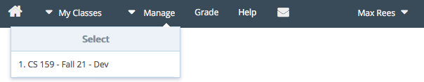
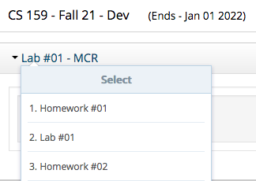
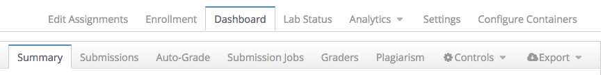

=======================================
 CS 15900 & Vocareum: lecturer's guide
=======================================
.. contents::
   :backlinks: top
.. section-numbering::
   :suffix: .

--------------------------------
 Getting started: the main menu
--------------------------------
Navigate to `labs.vocareum.com <https://labs.vocareum.com>`_. This
website is where you will manage your Vocareum course, where teaching
assistants will leave feedback for their students, and where the
students will do all of their work.

At the top of the screen you will see a dark blue menu bar which we will
call the "main menu".

In Vocareum, the highest level of access for a course is called a
"teacher", and this will be the role you have as a lecturer. For
teachers, the main menu entry that you will use is "Manage", from which
you can select the course with which you want to work.

You will notice that there are also a few other tabs. "My Classes" is
the primary tab for the student's view. It will only be visible to you
if you enroll yourself as a student in the course, which will be covered
later. Likewise, the "Grade" tab is the primary destination for teaching
assistants, which are classified in Vocareum as "Graders".

The "Help" link leads to Vocareum's documentation and help website. The
house-shaped icon goes to your home page, which has a listing of all
courses you have access to, including a link for each different role
(student, grader, or teacher).

The mail-shaped icon goes to your Vocareum messages page, where you
receive notifications from Vocareum when certain processes are
completed, such auto-grading, pushing grades to Brightspace, and so on.
It will bounce up and down if you have new messages, and will continue
to do so until you read them.

The menu entry with your name on it has links to some personal settings
and a "Logout" entry.

For now, we will click "1. CS 159 - Fall 21 - Dev" in the "Manage"
sub-menu of the main menu to begin working on the course as a teacher.

--------------------------
 The assignment dashboard
--------------------------
When opening a class from the "Manage" menu, your first stop is
typically the "assignment dashboard", which gives you the ability to
supervise each assignment in detail.

The left side of the screen will show the course title, and the
currently selected assignment. You can click the assignment's title to
select a different assignment.

The right side of the screen shows the other menus available for a
teacher on a white background, with "Dashboard" currently selected.
Below that is the "assignment dashboard menu" on a silver background,
with "Summary" currently selected. We will talk about all of these
different menus in detail.

~~~~~~~~~~~~~~~~~
 Student summary
~~~~~~~~~~~~~~~~~
Clicking on the "Summary" tab in the assignment dashboard menu leads to
the "student summary" page. This page allows you to view information
about any student in the course in regards to the currently selected
assignment.

.. image:: lecturer_student_summary_new.png

Initially, there will not be much information available here if the
assignment is not yet public, or the student hasn't yet opened the
assignment. Here we can see their name, email address, and section.
Three buttons are available.

Partner(s): **Allow solo**
  If the assignment has teams enabled, then there will be a "Partner(s)"
  table entry and an "Allow solo" button. This "Allow solo" button gives
  teachers the ability to override the team membership minimum imposed
  on the students, if students are the ones forming the teams.

  .. note:: For CS 15900, typically only "lab" assignments will have
     teams enabled, whereas homeworks and exams will be individual-only.
     The lab assignments will have a minimum team membership of two so
     that students cannot start on their own without at least one
     partner.

Grade: **Override**
  The "Override" button in the "Grade" table entry allows the teacher to
  set a sticky score for the student.

  .. caution:: Once set, this sticky score cannot be changed by either the
     auto-grader, nor by the teaching assistants.

LTI: **Push score**
  "LTI" stands for "Learning Tools Interoperability", and is the
  standardized specification of how external learning tools like
  Vocareum communicate with learning management systems like
  Brightspace.  The "Push score" button allows the teacher to manually
  send a score from Vocareum to Brightspace.

----

.. image:: lecturer_student_summary_not_submitted.png

Once students have opened their workarea but not yet made a submission,
the summary will look something like this. There are several new buttons
here.

Partner(s): **Add a partner**
  You can add any student who has not yet become part of a team to this
  team.

Partner(s): **Dissolve team**
  After asking for confirmation, this unlinks the team and destroys
  their shared workspace.

  .. note:: This button is only available if the team has not yet made a
     submission. Once a submission has been made, the team cannot be
     dissolved, and thus its members cannot be moved to a different
     team, except by contacting Vocareum support.

Status: **Extend submission window**
  You can override the deadlines and/or allowed number of submissions
  for each individual, or for each team on team assignments.

Status: **Force submit: [workarea]**
  This acts as if the student clicks the "Submit" button from their view
  of the assignment.

Status: **[upload]**
  You can upload files that will act as a student's submission.

View: **Activity**
  An audit log of every user's interaction with the student or team's
  assignment.

View: **Workarea**
  Show the view the student would see of the workarea for the
  assignment, essentially allowing you to "impersonate" them.

View: **Submissions**
  Show what a teaching assistant would see for the given assignment. 

Grader: **Add**
  Give an additional teaching assistant the ability to grade the
  assignment.

Grade: **Team override**
  Set a sticky score for the entire team.

Grade: **Individual override**
  Set a sticky score for an individual team member.

  .. caution:: As before, these sticky scores cannot be changed by
     either the auto-grader, nor by the teaching assistants once they
     are set.

Once a submission has been made and the auto-grader has been run, there
will be an additional button:

Status: **Reset autograde flag**
  Every time the auto-grader runs in Vocareum, it marks the assignment
  as having been auto-graded already. This button allows an individual
  assignment to be auto-graded *again* during the next batch.

  .. note:: If the flag has already been reset, or if the auto-grader
     has not been run yet, this button will not be visible.
