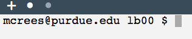
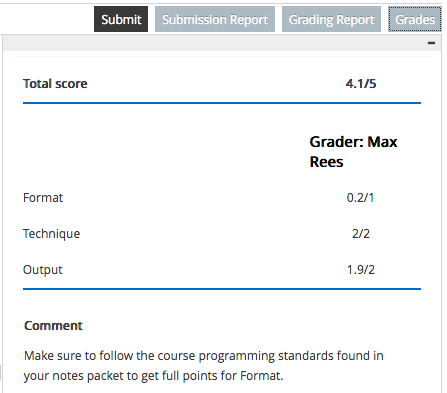

.. vi: ts=2 sts=2 sw=2 et spell tw=72

===================
 CS 15900 - Lab #0
===================
.. class:: center-element

+-----------------------+----------------------------------+
| Final submission due: | 30 minutes before your lab meets |
|                       | for the week of August 30        |
+-----------------------+----------------------------------+

.. class:: center-text

**Individual assignment**

----

.. contents::
   :backlinks: top
.. section-numbering::
   :suffix: .

-----------------
 Getting started
-----------------
Welcome to CS 15900! The weekly two-hour lab periods will be your
opportunity to put the concepts introduced during lecture into practice
in a collaborative environment with your fellow students.

The tasks that follow are designed to help you become familiar with how
you will be completing programming assignments in this class - including
both lab assignments (which are completed in teams of students) and
homework (which are completed individually). The tasks in lab #0 will be
individual as well, but feel free to ask your neighbors or teaching
assistant for help.

**You must understand these instructions in order to be able to complete
future assignments, so take your time** and revisit these activities as
necessary.

.. note:: If you were previously enrolled in this class, things have
   changed significantly since then. Please take the time to review this
   entire document.

-----------------------
 Submitting attendance
-----------------------
CS 15900 uses a digital attendance tracking system called the **lab
manager**, where students log their own attendance status to be reviewed
by their lab instructor. The lab manager only allows students to submit
attendance from ITaP computer workstations located within their lab
section room of record during the times in which the lab section is
holding class.

Specifically, you can mark yourself as "on-time" beginning 5 minutes
before your lab section starts, and up until 5 minutes after it starts.
As an example, for a lab section that starts at 9:30 AM, you would be
able to mark yourself as "on-time" anywhere between 9:25 AM and 9:35 AM.

After 5 minutes of the class have elapsed, you may only be able to mark
yourself as "late". After the class ends, you will not be able to submit
attendance for this assignment at all.

.. warning:: As noted in page 2 of the class syllabus, **students late
   or absent to more than two lab sessions will automatically fail the
   course.**

   It is therefore critical that you log in to the lab manager at the
   start of every class and mark yourself as on-time.

   You will not receive any points for lab programming assignments or
   lab quizzes if your attendance is not recorded as on-time for the
   date on which they occur.

Your lab instructor and lecturer have the ability to override your
attendance status if there is a **technical** issue regarding your
ability to access the lab manager, or if you have an **excused** reason
to be late. For all other issues, lab instructors are only allowed to
give you **one** override per semester.

Every lab programming assignment instructions document will contain a
link at the top to the lab manager so that you may mark yourself as
on-time for the assignment. **It is your responsibility to remember to
do so.**

You can log in to the lab manager and submit attendance for an
assignment at the following address. **You must log in from an ITaP
computer workstation in your lab section's room.**

.. note:: For security purposes, **you must open this link in a new
   tab**, otherwise it will not work. Right click the link, and select
   "open link in new tab".

https://web.ics.purdue.edu/~cs159/lab/submit_attendance.php

You should be presented with a screen similar to the following:

Your pending attendance status for each assignment is shown next to the
assignment name. Here, a green "On-time" box next to "Lab #0" indicates
that we are in the correct room at the correct time. However, the black
"Not submitted" box indicates that you have not yet submitted attendance
for this assignment.

.. note:: **For Lab #0 only**, it is okay if the lab manager believes
   you are late since this is your first time using it.

Click the checkbox next to "Lab #0", then click the "Submit" button. If
the submission was successful, a green confirmation box will appear near
the top of the screen indicating as such, and a green "Already
submitted" box will replace the black "Not submitted" box in the
assignment list.

You will also receive a confirmation email from cs159@purdue.edu.

.. admonition:: STOP!

   Raise your hand and ask your lab instructor to verify that you have
   completed the first checkpoint: attendance. They will check that your
   attendance record is in the lab manager.

By clicking the blue "CS 15900 lab manager" heading you can access the
lab manager's homepage. This includes a link to the page you were just
on ("Submit attendance for an assignment") as well as another link
(`"View my attendance records"
<https://web.ics.purdue.edu/~cs159/lab/student_attendance.php>`_, which
you can access from any computer - not just ones in your lab).

-----------------------
 Logging into Vocareum
-----------------------
All programming assignments are completed using a website called
Vocareum. Your access to Vocareum is controlled by the CS 15900 course
on `Brightspace <https://purdue.brightspace.com>`_ - always log in there
first if you haven't already.

Navigate to "Content", then "Week 1", then "Assignments". Open the link
that says "Lab #0 (Vocareum)". Your account with Vocareum will
automatically be created.

.. note:: Vocareum is not part of Purdue's single sign-on system. Each
   time you need to log in to Vocareum, you must do so using a link from
   Brightspace.

-------------------------------------
 Selecting and opening an assignment
-------------------------------------
Opening the link reveals a page like the following.

Across the top of the screen is a dark blue menu bar which we will call
the "main menu".

Clicking your name will reveal a menu that will take you to your
personal Vocareum settings or let you log out.

The "Help" tab takes you to Vocareum's documentation website.

The "home" icon will take you to a page that lists all of the courses
on Vocareum to which you have access. You can also switch courses using
the "my classes" menu.

The currently selected course is shown at the top of the screen, above
the "My Grade" button.

Along the left side of the screen is the list of assignments that are
currently published on Vocareum. The currently active assignment has a
blue bar on the left hand side.

Make a note of the due date if there is one present. You will not be
able to submit the assignment after the due date. **No late work is
accepted in CS 159.**

Click the blue "My Work" button to open the current assignment.

-----------------------
 The student workbench
-----------------------
The "My Work" button opens what is called the "student workbench". It is
from here that you will develop and submit all of your assignments.

Across the top of the screen will be the familiar main menu in dark
blue.

Below that is the name of the assignment (in this case, "Lab #0"). You
can click this assignment name to return to the assignment selection
screen.

The top right side of the screen has several buttons that can be used.

The four arrow icon will put Vocareum in full-screen mode. The "Readme"
button opens the lab instructions in the pane on the right hand side of
the screen. When you first open the workbench, the instructions are
already shown.

The left hand side of the screen is the interactive **terminal** -
essentially a text-based user interface for the remote computer on which
you will be doing your work. Shown below is the **terminal command
prompt**.

The prompt consists of your email address, the current assignment name,
and a dollar sign. When you begin typing, the characters you enter will
appear after the dollar sign. This is where you can enter commands that
the remote computer will perform (or "execute"). The gray box indicates
the position of your cursor (i.e. where the next character you enter
will appear).

You can click the "plus" button in the blue bar above the terminal to
open a new terminal tab. The active terminal tab is indicated by a white
dot, while other tabs are dark gray dots. Each terminal tab operates
independently, but has access to the same files.

.. note:: If the text in the terminal is too small for you to
   comfortably read, you can use your browser's zoom feature to make the
   text appear bigger. This is usually accomplished by holding down the
   ``Control`` key and pressing ``Shift`` and ``=`` (i.e. ``+``), or
   using ``Command`` instead of ``Control`` for Macs. To zoom back out,
   use ``-`` instead of ``Shift`` ``=``.

----------------------------------------------------------
 Navigating and managing files in a UNIX-like environment
----------------------------------------------------------
The operating system in which you will be working is Ubuntu, which is
based on the Linux kernel. This is a UNIX-like operating system, which
is very similar to Apple macOS and very different from Microsoft
Windows. All three share the same basic concepts, however: information
is stored in "files" and organized into "folders" containing files. In
UNIX terminology, folders are more often referred to as **directories**.
These two terms, folders and directories, may be used interchangeably.

When you first open the terminal, you are placed into the directory from
which you will be creating, testing, and submitting your assignments,
which we will refer to as the **workarea**. To see which files are in
your workarea, you can use the ``ls`` command. Type ``ls``, then hit the
``Enter`` key to execute the command.

.. note:: The command is written ``ls`` - that is, a lowercase "L"
   followed by a lowercase "S". It is short for "list", i.e. list the
   contents of the given or current working directory.

The results of the command (the "output") appear immediately below the
command prompt and the command name that you just typed. In this case,
the ``ls`` command says that there is a file named ``lb00.c`` in our
workarea. After a command finishes executing, the prompt will appear
again, indicating that the computer is ready to execute your next
command.

Some common UNIX commands include:

``cp FILE1 FILE2``
  Make a **copy** of ``FILE1`` named ``FILE2``.

``mv FILE1 FILE2``
  **Move** (i.e. rename) ``FILE1`` to ``FILE2``.

``rm FILE``
  **Remove** (i.e. delete) the file named ``FILE``. You can specify
  multiple files separated by spaces.

  .. danger:: You will be asked to confirm that you want to delete the
     file. **Once the file is deleted, it CANNOT be recovered!**

------------------------------
 Opening the "vi" text editor
------------------------------
A **text editor** is a program you use in order to edit text-based
files. This is similar in concept to Microsoft Word, except that there
is no bold, underline, etc. - all of the text in the file is "plain
text" (has no formatting).

The ``vi`` text editor will be the one officially supported by the
course. This particular editor is command-based and lacks the familiar
graphical environment that many are accustomed to on the computers of
today. The ``vi`` (pronounced vee-eye) editor does have many of the
tools and capabilities that we find in popular graphical text editors.
The editor does take time and practice to learn and to use but we
believe that you will find the effort to be beneficial as the semester
progresses, especially since ``vi`` is available on practically every
existing UNIX-like operating system out-of-the-box.

.. warning:: Other text editors will not be supported, especially during
   labs and office hours.

To launch the vi text editor while opening the existing ``lb00.c`` file,
type ``vi lb00.c`` at the terminal command prompt. This tells ``vi`` to
try to open the file named ``lb00.c``, or to begin working on a new file
with that name if it does not yet exist. A screen like the following is
shown in your terminal.

The blue bar at the bottom is called the **status line** and tells us
information about the file we are currently editing, including its name,
the coordinates of the cursor in rows and columns, and the last
modification time of the file.

The line of text directly below the status line, known as the **vi
command line**, states there are a total of 222 characters of text in
the file, spread across 13 lines.

Above the status line and below the terminal tab bar is the contents of
the file. The light blue tildes (``~``) near the bottom indicate that
there isn't enough lines in the file to fill the whole terminal screen,
so the last real line of the file is the closing brace (``}``) on a line
by itself just after the ``return 0;``.

.. note:: For this lab, we have provided you with a ``lb00.c`` file from
   which to start. In the future, you will still execute the same
   command to start your assignment (e.g. ``vi lb01.c`` or ``vi
   hw01.c``), but you will be shown a screen of just tildes (``~``)
   since the file does not exist and a new file is empty.

The colors of various parts of the text inside the file is known as
**syntax highlighting**. It's not part of the file itself, but rather
``vi`` recognizing that this is a C source file and coloring the
different parts as a visual aid for the programmer.

We will cover how to use ``vi`` in a later section. For now, hit the
``Escape`` key, then type ``:q!`` and hit the ``Enter`` key to exit
``vi`` and return to your terminal command prompt.

------------------------
 Compiling your program
------------------------
If you have programmed before, C might be slightly different from what
you have previously experienced in that it is a **compiled** rather than
**interpreted** language.

What this means for students both experienced and new to the C
programming language scene is that **your program must be compiled after
each change you make to the source code.** Compilation translates the
human-readable source code into a binary "executable" file that the
computer can then run as a program.

In this class we will use the GCC compiler, which can be accessed using
the ``gcc`` command from the terminal command prompt.

To compile your program, type ``gcc lb00.c`` and hit the ``Enter`` key.

Here we see that the ``gcc`` command did not give any output. This is
actually a good thing! It means that there weren't any issues compiling
your program. When we run the ``ls`` command again, there is now a new
file:

This new file is named ``a.out``, which is the default executable
filename GCC uses if none is provided. The green color and asterisk
indicate that this file is executable.

----------------------------
 Executing your new program
----------------------------
To run our newly-compiled program, type ``./a.out`` and hit the
``Enter`` key. This command will execute the file named ``a.out`` in the
current directory (for which a single dot is a shortcut name; the slash
separates the shortcut directory name from the filename).

Notice that the terminal command prompt does not appear again. This is
because the program is still executing - in fact, it's waiting for you
to enter a number.

.. note:: In CS 15900, all programs you create will use this arrow
   notation (``->``) to indicate that the user must enter a value for
   the program to continue.

The goal for this program is to output whatever numbers the user enters,
but rounded to the nearest tenth. Type ``1.06`` and hit the ``Enter``
key.

The program returns the value ``1.1`` and returns us to the terminal
command prompt, indicating the program has finished executing.

.. note:: If you ever want your program to stop executing immediately
   and return to the terminal command prompt, hit ``Control``-``C``.

--------------------------
 Submitting an assignment
--------------------------
When you are ready to submit your assignment, you can click the "Submit"
button at the upper right hand corner of the workbench. Vocareum will
ask you if you are sure - click the blue "Yes" button.

As the submission is processed, a spinning icon will appear next to the
"Submission report" button.

Once the submission is fully processed, this icon will disappear and the
results (known as the **submission report**) will appear in your
terminal.

In this case, the submission was not successful because we did not
include our Purdue email address inside of the program.

.. warning:: If the submission report says that the submission failed
   *for any reason*, then **no credit will be given for that
   submission**!

   Only the most recent submission is retained and graded, so be careful
   to always make a successful submission each time. In general,
   submissions can fail for any of the following reasons:

   * The required source file is not present or does not have the
     correct name.
   * The source file does not list your Purdue email address.
   * For homework assignments, submission will fail if you list **anyone
     else's** Purdue email addresses.
   * The program failed to compile.

You can also click the "Submission report" button to show this
information in a rich-text format.

Clicking the "Readme" button will return to the lab instructions.

-------------------------------------------
 Making changes to your program using "vi"
-------------------------------------------
You must insert your Purdue email address in the source file in order to
make a successful submission. Run ``vi lb00.c`` again to open vi and
edit the source file.

When you begin the ``vi`` text editor you will find yourself in **normal
mode**. In this mode you are able to issue commands such as to copy and
paste, save your changes, find and replace, and make other edits.

Complete the following:

#. Type ``gg``. This command will bring you to the first line of the
   file. You can also use your "up" arrow key until your cursor is on
   the first line.
#. Type ``hlb`` ("HLB", but all lower case) and hit ``Enter``. This will
   insert the course's standard documentation header for lab programming
   assignments.

   .. note:: For homework assignmens, use ``hhw`` instead.

   Your source code file will now resemble the following:

   .. image:: student_workarea_hlb.png
      :target: student_workarea_hlb.png

#. Move your cursor using the arrow keys to the line of the **third**
   lab partner. Resist the urge to reach for your mouse.
#. The command to delete a line is ``dd``. From anywhere on this line
   issue the ``dd`` command.
#. Next, move your cursor to the line for the first partner. Pressing
   the ``i`` key will open **insert mode**, which is how you type
   content into the file itself. This is indicated by ``-- INSERT --``
   appearing below the status line.

   .. image:: student_workarea_insert.png
      :target: student_workarea_insert.png

   You can now type freely and any text you enter will appear in the
   window as a new part of the file. You can also use your ``Backspace``
   key to delete the character that is immediately to the left of your
   cursor.
#. Use ``Backspace`` to remove ``login1`` and replace it with your
   Purdue username, so that your entire Purdue email address is listed.
#. Use your down arrow key to move to the next line. Change ``login2``
   to your TA's username, so that their entire Purdue email address is
   listed.

   .. note:: This will be the **ONLY** lab in which you list your TA's
      email address in the program documentation header.

   .. warning:: **NEVER** retain any variation of the
      ``login@purdue.edu`` address in your header as it will not be
      recognized as a valid address and will result in a **failed
      submission**.

   Your terminal screen will now look something like the following.

   .. image:: student_workarea_changed_emails.png
      :target: student_workarea_changed_emails.png

#. Note that there is now ``[+]`` located next to the ``~/lb00.c``
   filename in the status bar. This indicates that you have unsaved
   changes.
#. Hit the ``Escape`` key to return to normal mode.
#. Type ``:w`` and hit ``Enter`` to save your changes. The ``[+]``
   indicator will disappear, and a message below the status line will
   show that the file was "written" (saved) successfully.

   .. warning:: Your changes are not saved automatically, so you should
      periodically ``Escape`` and ``:w`` / ``Enter`` to save them as you
      work on your program. **Failure to do so could result in the loss
      of your changes should your computer disconnect from Vocareum for
      any reason.**

#. You can type ``:q`` and hit ``Enter`` to exit ``vi`` now.

   .. note:: If you want to quickly save your changes and exit ``vi`` at
      the same time, you can combine ``:w`` and ``:q`` into ``:wq``.

      If you want to exit **without** saving your changes, use ``:q!``
      instead of ``:q``. **Note that this will not ask you to confirm,
      so be careful that this is what you want!**

-----------------------------
 Re-submitting an assignment
-----------------------------
You can submit your assignment as many times as you like, up until the
submission deadline. For lab assignments, this is 30 minutes before the
next time your lab section meets. For homework assignments, this is 11
P.M. Eastern Time on Mondays.

Always make sure your program compiles first before submitting the
assignment using the ``gcc`` command. **Submissions that fail to compile
will not be given credit.**

Once you are ready to submit again, just click the "Submit" button once
more and confirm that you are ready to submit.

When a submission is successful, your terminal will have output that
looks something like the following. The key to note is that it says
``Your submission has been recorded``.

There are then three different ways to view the report for your
successful submission:

* A new file named ``submit.rst`` will appear in your workarea
  directory. You can view this using ``vi submit.rst``.
* An email will be sent from cs159@purdue.edu containing the contents of
  the ``submit.rst`` file.
* Clicking the "Submission report" button will show a rich-text format
  of the contents of the ``submit.rst`` file. Again, you can click the
  "Readme" button to go back to the assignment instructions.

.. admonition:: STOP!

   Raise your hand and ask your lab instructor to verify that you have
   completed the second checkpoint: submission. They will check that
   they received a submission confirmation email like you did.

---------------------------------
 Interpreting submission reports
---------------------------------
CS 15900 has an "auto-grader" that processes each student's submission
and assigns a preliminary grade which is based on the results of test
cases run against your submission and the formatting of the source code.
The submission report gives you an idea of what you should expect the
auto-grader will do when it presents your assignment to your lab
instructor for final review.

The result of each test is either pass or fail, but you get partial
credit depending on how much of the output from your program is
considered "correct".

In this example, we have failed all three test cases. Let's look at the
snippet for test #01 from ``submit.rst``.

The first section shows us the test number, what the full command was to
execute your program, and any input that was given. In this case, we see
that the auto-grader passed the values ``1.23`` and ``4.56`` to the
program::

  ==========
   Test #01
  ==========
  Command line::

  | 'lb00.elf'

  Input::

  | 1.23 4.56

The next section shows us the status of the test. Here, the test failed
because the output of your program did not exactly match the output of
the solution program::

  -------------
   Test failed
  -------------
  **ERROR:** program gave incorrect output

When a test case fails, the auto-grader will then include the output
from your program, as well as the output from the solution program::

  -------------
   Your output
  -------------
  ::

  | Enter measurement ->
  | -=-=-=-=-=-=-=-=-=-
  | The measurement is: 1.2

  -----------------
   Expected output
  -----------------
  ::

  | Enter measurement ->
  | -=-=-=-=-=-=-=-=-=-
  | The measurement rounded: 1.2

If you look at these two outputs carefully, you should notice that the
difference is that your program says "The measurement **is**:" while the
solution says "The measurement **rounded**:" The ``Difference`` section
visualizes this discrepancy in a text-based format::

  ------------
   Difference
  ------------
  ::

  | Enter measurement ->
  | -=-=-=-=-=-=-=-=-=-
  | The measurement [-is:-]{+rounded:+} 1.2

Here, the auto-grader is telling you to delete ``is:`` and put
``rounded:`` in its place.

In general, anything between ``[-`` and ``-]`` should be **removed**,
and anything between ``{+`` and ``+}`` should be **added**.

After the final test case, if there are formatting problems or other
issues with how you wrote your source file, the auto-grader will say
``Course standards violations detected``::

  ======================================
   Course standards violations detected
  ======================================

  ------------------
   Format
  ------------------
  - -1.5 Almost no comments present in the program
  - -0.2 Missing proper variable declaration comment, line 24

  ------------------
   Technique
  ------------------

  ------------------
   Output
  ------------------

This says that if the submission were to be graded right now, you
*might* lose 1.5 points for not including a sufficient number of
comments in the program, and 0.2 points for specifically not putting a
comment next to the ``float measurement;`` variable declaration on line
24.

-------------------------------------
 Viewing your grades and TA feedback
-------------------------------------
In general, each homework assignment is worth 10 points (2 points for
formatting, 4 points for technique, and 4 points for output) and each
lab assignment is worth 5 points (1 point for formatting, 2 points for
technique, and 2 points for output).

.. note:: All lab and homework grades are reviewed by your TA for
   accuracy, and they are allowed to override the auto-grader - either
   to give you back some points or make additional deductions. **Any
   questions regarding programming assignment grades should be directed
   at your TA.**

After the submission window for an assignment closes, the auto-grader
will be run against the submissions from all students. These
**preliminary** grades may be immediately visible inside Vocareum. Your
TA will then review all of the grades for your section for approval and
make any changes if necessary. Once they are finished, you will receive
an email that your grade has been finalized on Vocareum. **Any grade
that you see on Vocareum before you receive notification from your TA
that your grade has been finalized must be considered a preliminary
score only and is subject to change.**

.. note:: **For Lab #0 only**, a grade report will be generated as soon
   as you make a submission so that you may become familiar with it. For
   all other labs, grading will not be started until after the last lab
   section of the week finishes submission.

An assignment with visible grades will show a grade summary below the
blue "My Work" button, including a total score and a breakdown into the
categories of Format, Technique, and Output.

If your TA left you some personal feedback, this will appear below the
grade table under the heading "Comment".

.. note:: Your TA's name should appear here next to the label "Grader:".
   If there is no "Grader" on the grade table, then the grade has not
   yet been reviewed by anyone other than the auto-grader.

By clicking the "My work" button again, you can open the workbench to
view your grade report by clicking the "Grading Report" button in the
upper right hand corner of the screen.

Similarly to the submission report, the test cases are listed first.
Scroll to the bottom to view the grade break-down.

Clicking the "Grades" button will show the same information that was on
the assignment home page, including the feedback from your TA.

-------------------------
 Completing the lab quiz
-------------------------
At the end of each lab session, your lab instructor will direct you to
take your lab quiz. These quizzes are worth 5 points each. Your lab
instructor must proctor these quizzes - you may not take them on your
own time.

.. note:: **For Lab #0 only**, you may take this quiz once you reach
   this point. All other lab quizzes must be taken at the time your lab
   instructor designates. **You will lose credit for lab quizzes taken
   outside of your lab instructor's guidance, and such actions may
   result in academic integrity investigations.**

Return to the "Week 1 [Aug-23 - Aug-29]" content module on Brightspace,
where you should find "Lab quiz #0".

The following restrictions are in effect for all lab quizzes, unless you
have accommodations on file with the Disability Resource Center:

* You have only a **single attempt** to complete the quiz.
* You have **10 minutes** to complete the quiz once you start it.
* Each question is presented **one at a time**.
* Once you move to the next question you **cannot go back to previous
  questions**.

Click the blue "Start Quiz!" button to begin the quiz once you are
ready.

.. admonition:: STOP!

   **Once you submit the quiz**, raise your hand and ask your lab
   instructor to verify that you have completed the third and final
   checkpoint: quizzing. They will look for your lab quiz confirmation
   screen.
