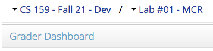
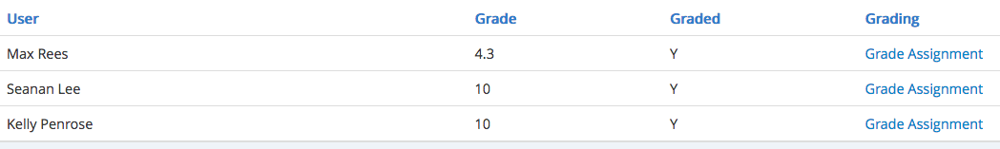
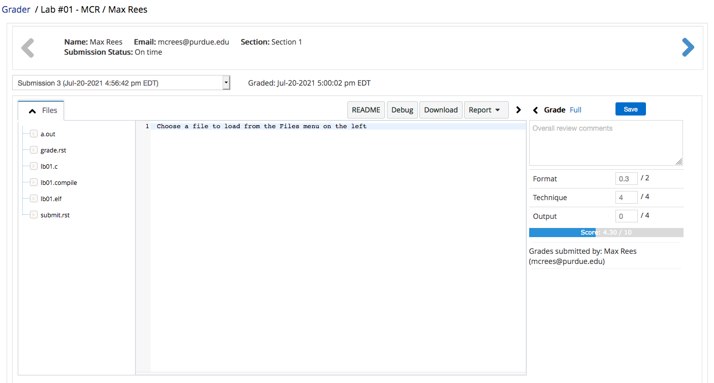
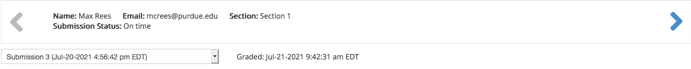
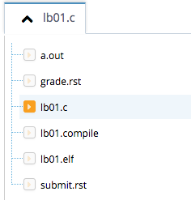
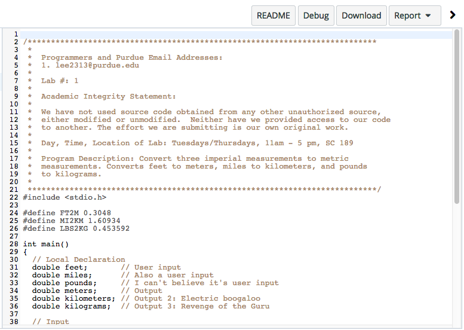
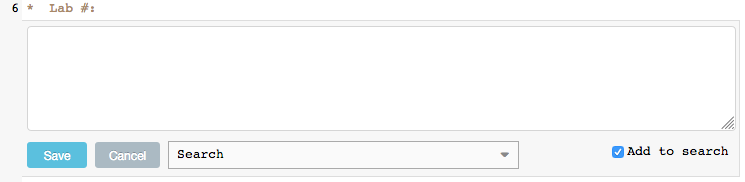
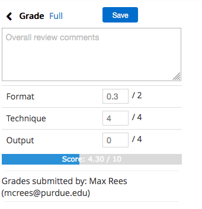
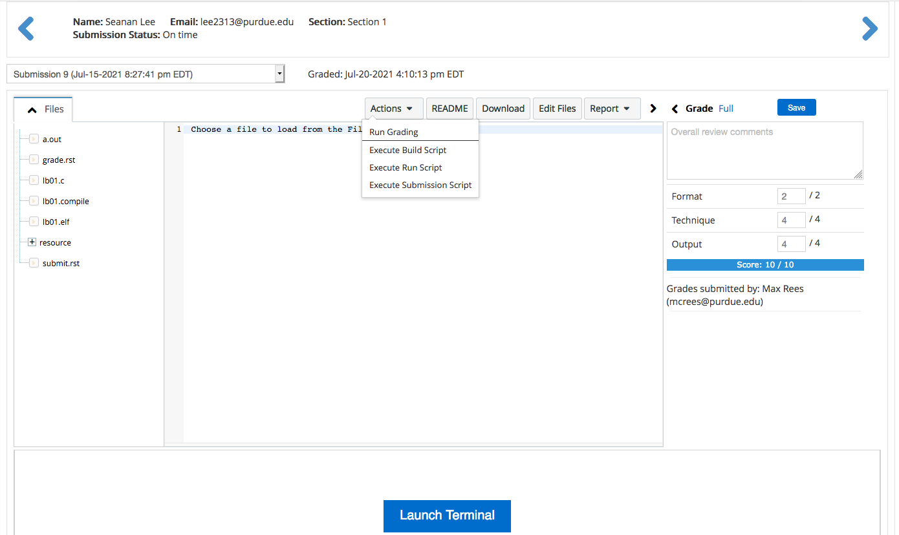

.. vi: ts=2 sts=2 sw=2 et spell tw=72

=================================================
 CS 15900 & Vocareum: teaching assistant's guide
=================================================
.. contents::
   :backlinks: top
.. section-numbering::
   :suffix: .

--------------------------------
 Getting started: the main menu
--------------------------------
Navigate to `labs.vocareum.com <https://labs.vocareum.com>`_. This
website is where you will leave feedback for your students as a teaching
assistant, and where students will do all of their work.

At the top of the screen you will see a dark blue menu bar which we will
call the "main menu".

Vocareum considers teaching assistants to be "Graders". Your primary
destination will be through the "Grade" tab.

You will notice that there are also a few other tabs. "My Classes" is
the primary tab for the Student's view. It will only be useful to you
if you are also enrolled in this class or other classes as a Student.

The "Help" link leads to Vocareum's documentation and help website. The
house-shaped icon goes to your home page, which has a listing of all
courses you have access to, including a link for each different role
(Student or Grader).

The mail-shaped icon goes to your Vocareum messages page. It will bounce
up and down if you have new messages, and will continue to do so until
you read them.

The menu entry with your name on it has links to some personal settings
and a "Logout" entry.

Click the "Grade" tab to continue.

------------------
 Grader dashboard
------------------
Clicking the "Grade" tab opens the Grader dashboard, where you can view
the list of assignments that need your attention. The top of the screen
shows the currently active course and assignment. You can click either
to select a different course or a different assignment.

If there are submissions available for you to look at, they will be
presented in a table like the following, which includes the Students'
names and their current grades as determined by the auto-grader. The
"Graded" column will typically always be "Y", indicating that they have
been processed by the auto-grader.

Click "Grade Assignment" for any Student to open the submission viewer.

-------------------
 Submission viewer
-------------------
There are many different parts of this interface. At the very top of the
screen is a breadcrumb trail that allows you to return to the Grader
dashboard by clicking "Grader". Next to it is the name of the assignment
for which the submission was made.

~~~~~~~~~~~~~~~~~
 Submission pane
~~~~~~~~~~~~~~~~~
The pane across the top of the screen shows information about the
submission, such as the Student(s) name(s) and email address(es), the
section of the Student(s), whether the submission was considered late or
not, and the last time the grade was modified (whether that be by the
auto-grader, yourself, possibly another TA, or a lecturer).

The large blue/gray arrows on either side allow you to go to the
previous and next Student or team for the assignment. If the arrow is
gray, there are no more Students or teams in that direction.

The drop down box shows how many times a submission has been made for
this assignment by this Student or team, and at which time each
submission was made. The latest submission should be selected by
default.

.. note:: You may view earlier submissions, but keep in mind that **the
   grade should always reflect the work of the latest submission only.**

~~~~~~~~~~~~
 Files pane
~~~~~~~~~~~~
The "Files" pane on the left shows all of the files that are part of the
Student's submission. This includes some files that are generated by the
submission or grading scripts. The currently selected file, if any, has
an orange icon next to it. The name of this file will also replace
"Files" in the pane's title. You can click the caret icon (``^``) to
hide the Files pane.

The files generated by the submission and grading scripts include:

==================================== ===================================
Name or extension                    Description
==================================== ===================================
``*.compile``                        Output captured from the compiler
                                     at submission time.
``*.elf``                            Executable created by the compiler
                                     at submission time (instead of
                                     ``a.out``).
``submit.rst``                       Submission report in a plain-text
                                     format. This is essentially the
                                     same contents as the submission
                                     receipt email that gets sent to
                                     Students.
``grade.rst``                        Grade report in a plain-text
                                     format, as generated by the
                                     auto-grader. **This is the file you
                                     should pay the most attention to,
                                     in addition to the Student's source
                                     file.**
==================================== ===================================

After grades have been published, you may see some additional files
starting with ".voc". These are essentially duplicates or alternative
formats of the files listed above and can be safely ignored.

.. note:: While the submission may contain an ``a.out`` executable that
   the Student created interactively, the file ending in ``.elf`` is the
   officially submitted executable (compiled by the submission script at
   submission time) that was tested by the auto-grader.

~~~~~~~~~~~~~
 Source pane
~~~~~~~~~~~~~
The Source pane in the center shows the contents of the file you select
from the `Files pane`_. This includes some rudimentary syntax
highlighting as well as line numbers. You cannot edit files using the
source pane.

The buttons along the top include:

**README**
  Opens the assignment instructions as a floating pane.

**Debug**
  Opens the `submission debugger`_.

**Download**
  *This button appears to be broken at the moment.* It typically allows
  you to download the submission as a ZIP file.

**Report**
  *This button appears to be broken at the moment.* It typically allows
  you to view the same HTML reports that the Students can see, but it
  seems this only works if grades have already been published. Instead,
  you will view the plain-text report files described earlier. Or, you
  can view the HTML reports inside the `submission debugger`_.

The right arrow icon (``>``) can be used to collapse the grade pane.

If you double click on text inside of the source pane, you are presented
with an option to create an in-line comment.

.. warning:: **Do not use this feature!** Students will not be able to
   see these comments due to the limitations of Vocareum in its current
   configuration. Hit "Cancel" to close the dialog. **Only put your
   feedback in the grade pane** (see below).

~~~~~~~~~~~~
 Grade pane
~~~~~~~~~~~~
Here you can adjust the grade for the submission and leave feedback.
Adjusting the score for any of the rubric items (Format, Technique,
Output) automatically adjusts the overall grade, which is shown in the
progress bar below as "Score". You can also click the blue "Full" link
to give full points for the submission.

When you are ready to save the scores and feedback, click the blue
"Save" button.

If you want to reset your changes, refresh the page without hitting the
"Save" button.

.. danger:: If you refresh the page, you may be taken to a different
   Student's submission, so you will need to ensure that you return to
   the correct one.

At the bottom of the pane it will say "Grades submitted by:". At first
this will list the lecturer who executed the auto-grader. After you
click "Save" at least once, it will be replaced by your name.

.. note:: You should always leave some sort of feedback, even if it's
   simple as a "Great job!" for a perfect submission. This allows the
   lecturers to verify that you have reviewed all of the submissions
   assigned to you. **Make sure you click the "Save" button!**

You can click the right arrow icon (``<``) to make the grade pane
slightly bigger.

---------------------
 Submission debugger
---------------------
By clicking the "Debug" button in the `source pane`_, you can open an
interactive terminal similar to what the Students use. Click the blue
"Launch Terminal" button at the bottom of the screen to do so.

There is also a new button in the `source pane`_: "Actions".

**Run Grading**
  Executes the auto-grader again.

  .. warning:: This will immediately change the scores and save them.

**Execute Build Script**
  We don't have a build script for this class, so this will do nothing
  useful.

**Execute Run Script**
  Likewise, we don't have a run script, either.

**Execute Submission Script**
  Re-runs the submission process.

  .. danger:: **Do not use this feature!** In all likelihood, the
     submission script will become confused because the email address in
     the submission's source file will not match your email address,
     which will cause the submission to fail.

The "Edit Files" button doesn't seem to do anything useful, as you still
cannot edit the files in the `source pane`_. However, you can make
changes using the terminal.

The "Report" button should work in this mode, allowing you to view the
HTML versions of the submission and grade reports.

If you click the blue arrows to move to the next Student or team, you
will still be in the submission debugger. You will need to return to the
`grader dashboard`_ in order to get back to the normal `submission
viewer`_.

----------
 Workflow
----------
#. Open the `grader dashboard`_. Select the class and assignment you
   need to work on.
#. Open each Student or team's **latest** submission, using either the
   `submission viewer`_ or the `submission debugger`_.
#. View the ``grade.rst`` report file from the auto-grader. The test
   cases will be listed first, followed by a breakdown of the grade and
   any deductions that were made.
#. Verify that these deductions are correct by reviewing the test cases
   and the Student or team's program source file. If a deduction made by
   the auto-grader is incorrect, give back the points by adjusting the
   scores accordingly and leave a remark in the "overall review
   comments" text box in the `grade pane`_.
#. Review the program source file for any `additional deductions`_ to be
   made. If there are any, include the deduction in the "overall review
   comments" text box and adjust the scores as necessary.
#. Make sure you leave some sort of feedback as well in the grade pane.
#. Click the blue "Save" button.
#. Use the big blue arrows to navigate to the next Student or team.
#. Continue until you have reviewed all Students or teams for this
   assignment.
#. To ensure you have clicked "Save" on every grade, refresh the page
   and go back through each Student or team to verify that your name is
   listed at the bottom of the grade pane.

You will be notified (via email or weekly TA meeting) when grades have
been pushed to Brightspace, after which you will need to tell your
supervising lecturer if a grade needs to be changed.

You will be notified (via email or weekly TA meeting) when you are
behind on your grading.

-----------------------
 Additional deductions
-----------------------
The previous auto-grader on the ``guru`` server would leave additional
deductions that needed to be reviewed manually by a TA under a line of
dashes (``---``). These standardized additional deductions are now
listed here. You should return to this section when grading **every
assignment** to ensure that you make these deductions as appropriate.

========= ====== =====================================================
Category  Points Description
========= ====== =====================================================
Format    -0.2   Program header block comment lacked an adequate
                 documentation
Format    -0.2   Function header block comment lacked an adequate
                 documentation
Format    -0.5   You must use meaningful variable names for all
                 variables
Technique -0.5   Only major control processes belong in the main
                 function
Technique -0.5   Each user-defined function must be devoted to only one
                 specific task
Technique -0.5   Your algorithm does not meet the standards for
                 efficiency
Technique -4.0   Not a reasonable attempt at the stated assignment
                 (format deduction too)
Technique -4.0   Technique exceeded the current material covered (output
                 deduction too)
========= ====== =====================================================
